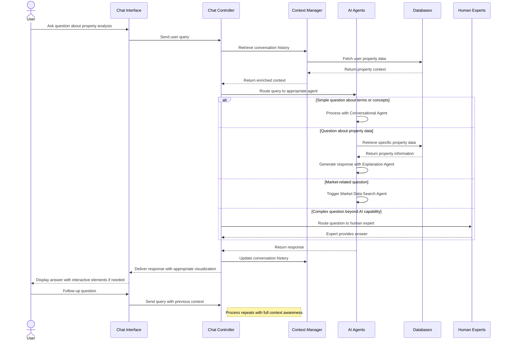

# Adding Chat Functionality to the Property Investment Analysis Application

Adding chat functionality would be a valuable enhancement to your application, allowing users to get immediate assistance, explanations, and personalized guidance throughout their property analysis journey. Here's how we can integrate this feature into the existing requirements:

## New Chat Requirements to Add to the Document

| **Requirement ID** | **Description** | **User Story** | **Expected Behavior/Outcome** |
|-------------------|-----------------|----------------|------------------------------|
| **CH-001** | Conversational Assistant | As a user, I want to ask questions about my property analysis in natural language. | The system provides a chat interface where users can ask questions about financial terms, calculation methods, or specific aspects of their property analysis. The assistant leverages LLMs to provide contextually relevant answers based on the user's specific property data. |
| **CH-002** | Guided Analysis Walkthrough | As a new user, I want step-by-step guidance while analyzing my first property. | Chat assistant proactively offers guidance at each stage of the analysis process, explaining what inputs are needed and why they matter. Users can ask for clarification at any point, with the assistant providing tailored explanations. |
| **CH-003** | Investment Decision Support | As an investor, I want help interpreting analysis results and understanding their implications. | Chat system explains complex metrics, highlights key risk factors, and provides personalized advice based on the user's investment goals and risk tolerance. Recommendations are clearly labeled as AI-generated with appropriate confidence levels. |
| **CH-004** | Document-Aware Chat | As a user, I want to ask questions about specific documents I've uploaded. | Chat assistant can reference and explain information from user-uploaded documents (leases, inspection reports, etc.), answering questions like "What does the inspection report say about the roof?" with precise information extraction. |
| **CH-005** | Market Information Retrieval | As an investor, I want to ask questions about market conditions in my target location. | Chat system can trigger the Market Data Search Agent to retrieve current information about a specific neighborhood, answering questions like "What's the vacancy rate in this area?" or "Are there any new development projects nearby?" |
| **CH-006** | Chat Memory and Context | As a user, I want the chat system to remember our conversation history and my property details. | Chat system maintains contextual awareness across the conversation, remembering previously discussed properties, user preferences, and specific concerns, eliminating the need for users to repeat information. |
| **CH-007** | Multi-Property Comparison | As an investor, I want to compare multiple properties through conversational questions. | Users can ask comparative questions like "Which property has better cash flow?" or "Show me the differences in tax benefits between these two properties," and receive clear, structured responses highlighting key differences. |
| **CH-008** | Human Expert Escalation | As a user, I want to be connected with a human expert for complex questions. | Chat system recognizes when questions exceed its capabilities and offers to connect the user with appropriate human experts (tax advisors, property managers, etc.) while documenting the conversation for seamless handoff. |

## Updated System Architecture Diagram

Here's how the chat functionality would integrate with the existing system architecture:

```mermaid
flowchart TD
    subgraph "User Interface"
        UI[Web/Mobile Interface]
        Dashboard[Interactive Dashboard]
        Reports[Report Generation]
        ChatInterface[Chat Interface] %% New component
    end

    subgraph "Core Application"
        API[API Layer]
        Auth[Authentication]
        Calc[Calculation Engine]
        Orchestrator[AI Agent Orchestrator]
        ChatController[Chat Controller] %% New component
        ContextManager[Chat Context Manager] %% New component
    end

    subgraph "AI Agents"
        SearchAgent[Market Data Search Agent]
        RentAgent[Rent Estimation Agent]
        TaxAgent[Tax Regulation Agent]
        RiskAgent[Risk Assessment Agent]
        DocAgent[Document Analysis Agent]
        OptAgent[Optimization Agent]
        ChatAgent[Conversational Agent] %% New component
        ExplainerAgent[Explanation Agent] %% New component
    end

    subgraph "Data Storage"
        UserDB[(User Database)]
        PropertyDB[(Property Database)]
        MarketDB[(Market Data Database)]
        VectorDB[(Vector Knowledge Base)]
        ChatHistoryDB[(Chat History Database)] %% New component
    end

    subgraph "External Services"
        RealEstate[Real Estate Websites]
        GovData[Government Databases]
        TaxRegs[Tax Regulation Sources]
        MortgageAPI[Mortgage Rate APIs]
        LLM[LLM Providers]
        HumanExperts[Human Experts Network] %% New component
    end

    ChatInterface --> ChatController
    ChatController --> ContextManager
    ContextManager --> ChatHistoryDB
    ChatController --> Orchestrator
    ChatController --> API
    
    Orchestrator --> ChatAgent
    Orchestrator --> ExplainerAgent
    
    ChatAgent --> LLM
    ExplainerAgent --> LLM
    
    ChatAgent --> PropertyDB
    ChatAgent --> VectorDB
    ChatAgent --> MarketDB
    
    ExplainerAgent --> VectorDB
    
    ChatController --> HumanExperts
    
    %% Existing connections
    UI --> API
    Dashboard --> API
    Reports --> API
    
    API --> Auth
    API --> Calc
    API --> Orchestrator
    
    Orchestrator --> SearchAgent
    Orchestrator --> RentAgent
    Orchestrator --> TaxAgent
    Orchestrator --> RiskAgent
    Orchestrator --> DocAgent
    Orchestrator --> OptAgent
    
    SearchAgent --> RealEstate
    SearchAgent --> GovData
    TaxAgent --> TaxRegs
    RentAgent --> MarketDB
    DocAgent --> PropertyDB
    OptAgent --> VectorDB
    
    SearchAgent --> MarketDB
    RentAgent --> LLM
    TaxAgent --> VectorDB
    RiskAgent --> LLM
    DocAgent --> LLM
    OptAgent --> LLM
    
    Calc --> UserDB
    Calc --> PropertyDB
    Calc --> MarketDB
    
    UserDB --> API
    PropertyDB --> API
    MarketDB --> API
```

## Chat Interaction Flow

Here's a sequence diagram showing how users would interact with the chat system:



## Technical Implementation for Chat Functionality

Given your preference for Python, implementing the chat functionality would involve:

1. **LLM Integration**: Using Python libraries like LangChain or LlamaIndex to integrate with LLM providers (OpenAI, Anthropic) for the conversational assistant.

2. **Context Management**: Implementing a vector database (ChromaDB, Pinecone) for storing conversation history and retrieving relevant context.

3. **Agent Framework**: Extending the existing Python-based agent orchestration to include specialized conversational agents that can access property data.

4. **WebSockets**: Using Django Channels or FastAPI with WebSockets for real-time chat communication.

5. **Knowledge Base**: Building a structured knowledge base about real estate investing, financial terms, and tax regulations that agents can reference.

6. **Human-in-the-Loop**: Implementing a routing system that can escalate complex questions to human experts when needed.

## Sample Python Code for Chat Controller

Here's a conceptual example of how you might implement the chat controller in Python:

```python
class ChatController:
    def __init__(self, agent_orchestrator, context_manager, llm_service):
        self.agent_orchestrator = agent_orchestrator
        self.context_manager = context_manager
        self.llm_service = llm_service
        
    async def process_message(self, user_id, message, active_property_id=None):
        # Retrieve conversation history and user context
        conversation_history = await self.context_manager.get_recent_history(user_id)
        user_context = await self.context_manager.get_user_context(user_id)
        
        # Get property context if applicable
        property_context = None
        if active_property_id:
            property_context = await self.context_manager.get_property_context(active_property_id)
        
        # Determine message intent and route to appropriate agent
        intent = await self.determine_intent(message, conversation_history)
        
        if intent.requires_human_expert:
            return await self.route_to_human_expert(user_id, message, conversation_history)
            
        # Select appropriate agent based on intent
        if intent.type == "market_data":
            response = await self.agent_orchestrator.run_agent(
                "market_search", 
                {"query": message, "location": property_context.get("location")}
            )
        elif intent.type == "property_explanation":
            response = await self.agent_orchestrator.run_agent(
                "explanation", 
                {"query": message, "property_data": property_context}
            )
        else:
            # Default to conversational agent
            response = await self.agent_orchestrator.run_agent(
                "conversation", 
                {"query": message, "history": conversation_history, "context": user_context}
            )
        
        # Update conversation history
        await self.context_manager.add_to_history(user_id, message, response)
        
        return response
        
    async def determine_intent(self, message, history):
        # Use LLM to classify the intent of the message
        prompt = self._build_intent_classification_prompt(message, history)
        intent_classification = await self.llm_service.complete(prompt)
        return self._parse_intent(intent_classification)
```

## Would you like to incorporate this chat functionality into your application requirements document?

I can update the full Project Requirements Document to include these chat features if you'd like, or we can further refine the requirements based on your specific needs.