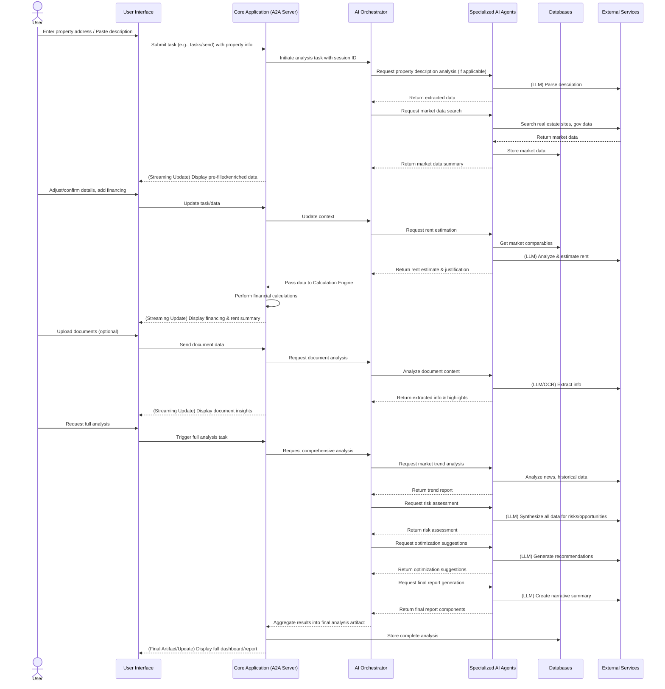

# Property Investment Analysis Application
## Project Requirements Document

**Version:** 1.1  
**Date:** April 25, 2025  
**Author:** Ali Bina (Updated by Gemini)

---

## Executive Summary

This document outlines the comprehensive requirements for a Property Investment Analysis Application with integrated AI capabilities. The application aims to automate and enhance the process of evaluating property investments by providing accurate financial projections, real-time market data, and intelligent analysis. The system leverages advanced AI agents, coordinated by an orchestrator, to collect market information, analyze investment potential, monitor regulatory changes, and generate insights in natural language, inspired by architectures like Semantic Kernel.

---

## 1. Project Overview

### 1.1 Purpose

The Property Investment Analysis Application will serve as a comprehensive tool for real estate investors to evaluate potential property investments. The application will automate complex calculations, retrieve current market data, and provide intelligent analysis to support informed investment decisions.

### 1.2 Scope

The application will include:
- Property data management
- Financial calculation engine
- AI-powered market data collection
- Intelligent investment analysis via orchestrated AI agents
- Document processing capabilities
- Reporting and visualization tools
- User account management
- Agent-to-Agent (A2A) protocol for communication (conceptual)

### 1.3 Target Users

- Individual property investors
- Professional real estate investors
- Investment advisors
- Property portfolio managers
- Real estate investment firms

---

## 2. System Architecture Overview

```mermaid

flowchart TD
    subgraph "User Interface"
        UI[Web/Mobile Interface]
        Dashboard[Interactive Dashboard]
        Reports[Report Generation]
    end

    subgraph "Core Application"
        API[API Layer / A2A Server]
        Auth[Authentication]
        Calc[Calculation Engine]
        Orchestrator[AI Agent Orchestrator]
    end

    subgraph "AI Agents (Plugins)"
        SearchAgent[Market Data Search Agent Plugin]
        RentAgent[Rent Estimation Agent Plugin]
        TaxAgent[Tax Regulation Agent Plugin]
        RiskAgent[Risk Assessment Agent Plugin]
        DocAgent[Document Analysis Agent Plugin]
        OptAgent[Optimization Agent Plugin]
        TrendAgent[Market Trend Agent Plugin]
        MortgageAgent[Mortgage Rate Agent Plugin]
        DescAgent[Description Analysis Agent Plugin]
        ReportAgent[Reporting Agent Plugin]
    end

    subgraph "Data Storage"
        UserDB[(User Database)]
        PropertyDB[(Property Database)]
        MarketDB[(Market Data Database)]
        VectorDB[(Vector Knowledge Base)]
    end

    subgraph "External Services"
        RealEstate[Real Estate Websites]
        GovData[Government Databases]
        TaxRegs[Tax Regulation Sources]
        MortgageAPI[Mortgage Rate APIs]
        NewsAPI[News Feeds / APIs]
        LLM[LLM Providers]
    end

    UI --> API
    Dashboard --> API
    Reports --> API

    API --> Auth
    API --> Calc
    API --> Orchestrator

    Orchestrator --> SearchAgent
    Orchestrator --> RentAgent
    Orchestrator --> TaxAgent
    Orchestrator --> RiskAgent
    Orchestrator --> DocAgent
    Orchestrator --> OptAgent
    Orchestrator --> TrendAgent
    Orchestrator --> MortgageAgent
    Orchestrator --> DescAgent
    Orchestrator --> ReportAgent


    SearchAgent --> RealEstate
    SearchAgent --> GovData
    TaxAgent --> TaxRegs
    RentAgent --> MarketDB
    DocAgent --> PropertyDB
    OptAgent --> VectorDB
    TrendAgent --> MarketDB
    TrendAgent --> NewsAPI
    MortgageAgent --> MortgageAPI
    DescAgent --> LLM


    SearchAgent --> MarketDB
    RentAgent --> LLM
    TaxAgent --> VectorDB
    RiskAgent --> LLM
    DocAgent --> LLM
    OptAgent --> LLM
    TrendAgent --> LLM
    ReportAgent --> LLM

    Calc --> UserDB
    Calc --> PropertyDB
    Calc --> MarketDB

    UserDB --> API
    PropertyDB --> API
    MarketDB --> API
```


---
## 3. User Workflow



## 4. AI Agent Orchestration

```mermaid
flowchart TD
    subgraph "AI Agent Orchestrator"
        TaskQueue[Task Queue Manager]
        AgentRouter[Agent Router/Planner]
        ContextManager[Context Manager (e.g., ChatHistory)]
        ResultsAggregator[Results Aggregator]
        FeedbackCollector[Feedback Collector]
    end

    subgraph "Agent Plugins (Examples)"
        SearchAgent[Market Data Search Plugin]
        RentAgent[Rent Estimation Plugin]
        RiskAgent[Risk Assessment Plugin]
        ReportAgent[Reporting Plugin]
    end

    subgraph "Agent Tools/Capabilities"
        WebScraper[Web Scraper Tool]
        LLMInterface[LLM Interface Tool]
        DataProcessor[Data Processor Tool]
        VerificationEngine[Verification Engine]
        DBCaller[Database Query Tool]
    end

    CoreApp[Core Application / A2A Server] --> TaskQueue
    TaskQueue --> AgentRouter

    AgentRouter --> SearchAgent
    AgentRouter --> RentAgent
    AgentRouter --> RiskAgent
    AgentRouter --> ReportAgent
    %% ... other agents ...

    SearchAgent --> WebScraper
    SearchAgent --> DBCaller
    RentAgent --> LLMInterface
    RentAgent --> DBCaller
    RiskAgent --> LLMInterface
    RiskAgent --> DBCaller
    ReportAgent --> LLMInterface

    SearchAgent --> DataProcessor
    RentAgent --> DataProcessor
    RiskAgent --> DataProcessor
    ReportAgent --> DataProcessor

    DataProcessor --> VerificationEngine

    SearchAgent --> ContextManager
    RentAgent --> ContextManager
    RiskAgent --> ContextManager
    ReportAgent --> ContextManager

    ContextManager --> ResultsAggregator
    ResultsAggregator --> CoreApp

    CoreApp --> FeedbackCollector
    FeedbackCollector --> SearchAgent
    FeedbackCollector --> RentAgent
    FeedbackCollector --> RiskAgent
    FeedbackCollector --> ReportAgent

    class SearchAgent,RentAgent,RiskAgent,ReportAgent agentNode;
    classDef agentNode fill:#f9f,stroke:#333,stroke-width:2px;
```

## 5. Data Processing Pipeline

```mermaid
flowchart LR
    RawData[Raw Data Input (User, Web, Docs)] --> Extraction[Data Extraction]
    Extraction --> Validation[Data Validation & Verification]
    Validation --> Enrichment[Data Enrichment]
    Enrichment --> Normalization[Data Normalization & Structuring]
    Normalization --> Storage[Data Storage]
    Normalization --> LLMProcessing[LLM Analysis & Synthesis]

    subgraph "Data Extraction Layer"
        WebScraper[Web Scraper]
        DocumentParser[Document Parser (OCR/LLM)]
        APIConnector[API Connector]
        UserInput[User Input Processor]
    end

    subgraph "Data Validation Layer"
        ConsistencyCheck[Consistency Checker]
        OutlierDetection[Outlier Detection]
        SourceVerification[Source Cross-Referencing]
        ConfidenceScoring[Confidence Scoring]
    end

    subgraph "Data Enrichment Layer"
        HistoricalComparison[Historical Data Linking]
        GeographicalContext[Geo-Contextualization]
        MarketTrends[Trend Data Integration]
        RegulationContext[Regulatory Data Linking]
    end

    subgraph "LLM Processing Layer"
        Summarization[Summarization]
        RiskAnalysis[Risk Identification]
        OpportunityIdentification[Opportunity Spotting]
        NarrativeGeneration[Explanation Generation]
        Estimation[Rent/Value Estimation]
    end

    Extraction --> WebScraper
    Extraction --> DocumentParser
    Extraction --> APIConnector
    Extraction --> UserInput

    Validation --> ConsistencyCheck
    Validation --> OutlierDetection
    Validation --> SourceVerification
    Validation --> ConfidenceScoring

    Enrichment --> HistoricalComparison
    Enrichment --> GeographicalContext
    Enrichment --> MarketTrends
    Enrichment --> RegulationContext

    LLMProcessing --> Summarization
    LLMProcessing --> RiskAnalysis
    LLMProcessing --> OpportunityIdentification
    LLMProcessing --> NarrativeGeneration
    LLMProcessing --> Estimation


    Storage --> PropertyDB[(Property Database)]
    Storage --> MarketDB[(Market Database)]
    Storage --> KnowledgeDB[(Vector Knowledge Base)]
    Storage --> ReportDB[(Report Database)]

    LLMProcessing --> KnowledgeDB %% LLM outputs can enrich the KB
    KnowledgeDB --> LLMProcessing %% RAG pattern
```

## 6. Calculation Engine Flow

```mermaid
flowchart TD
    PropData[Property Data (User Input + Agent Enriched)] --> Financing[Financing Module]
    PropData --> Income[Income Module]
    PropData --> Expense[Expense Module]
    PropData --> Tax[Tax Module]

    Financing --> CashFlow[Cash Flow Module]
    Income --> CashFlow
    Expense --> CashFlow
    Tax --> CashFlow

    CashFlow --> Metrics[Investment Metrics (ROI, CapRate, etc.)]
    CashFlow --> Sensitivity[Sensitivity Analysis]

    Metrics --> ReportGen[Report Generation]
    Sensitivity --> ReportGen

    subgraph "AI Agent Inputs / Enhancements"
        MarketAgent[Market Data Agent Output]
        RentAgent[Rent Estimation Agent Output]
        TaxAgent[Tax Regulation Agent Output]
        OptimizationAgent[Optimization Agent Suggestions]
        NarrativeAgent[Reporting Agent]
    end

    MarketAgent --> Income
    MarketAgent --> Metrics
    RentAgent --> Income
    TaxAgent --> Tax
    OptimizationAgent --> Sensitivity
    OptimizationAgent --> ReportGen
    NarrativeAgent --> ReportGen

    ReportGen --> FinalReport[Investment Report Artifact]
```

7. Detailed Requirements

7.1 Core Application Requirements

Requirement IDDescriptionUser StoryExpected Behavior/OutcomeFR-001Property Data InputAs a property investor, I want to enter basic property details so that I can analyze its investment potential.The system should provide input fields for property address, purchase price, property type, year built, size in square meters, number of units, and condition assessment. Data validation ensures numbers are within reasonable ranges. Fields can be auto-populated by AI agents (e.g., Description Analysis Agent).FR-002Purchase Cost CalculatorAs an investor, I want to calculate total acquisition costs including closing fees so I understand the full initial investment.When a user enters the purchase price, the system automatically calculates estimated closing costs (notary, tax, agent fees) based on regional standards (potentially informed by Tax/Regulation Agent). User can override with actual figures. Total acquisition cost updates automatically.FR-003Financing DetailsAs an investor, I want to input my financing structure so I can understand my loan requirements.User can enter available cash, desired down payment, and receive calculations for loan amount needed. System should validate that down payment meets minimum requirements. Can be enhanced by Mortgage Rate Agent findings.FR-004Mortgage Payment CalculatorAs an investor, I want to calculate my monthly mortgage payments based on various financing terms.System calculates monthly payments using input loan amount, interest rate, repayment rate (Tilgung), and term. Calculations should show amortization schedule. Can compare against current rates from Mortgage Rate Agent.FR-005Multi-Unit Rental StructureAs an investor buying a multi-unit building, I want to input details for each unit independently.System allows adding information for multiple units (occupied/vacant status, size, current rent, potential rent, lease terms). Each unit should be stored separately. Rent fields can be populated by Rent Estimation Agent.FR-006Rental Income ProjectionsAs an investor, I want to estimate potential rental income for vacant units based on local market data.System calculates potential rent based on unit size, features, and location using either manual input or suggestions from the Rent Estimation Agent, which cites sources and checks regulations (Mietpreisbremse).FR-007Operating Expenses CalculationAs an investor, I want to estimate all recurring expenses to determine net operating income.System calculates all regular expenses including property tax (informed by Tax Agent), insurance, non-recoverable maintenance costs (potentially informed by Doc Analysis), property management, and a reserve fund. Expenses calculated as fixed amounts and percentages.FR-008Tax Benefit CalculatorAs an investor, I want to estimate my tax benefits from property depreciation and expenses.System calculates depreciation (AfA) based on building value and current rules (verified by Tax Agent), mortgage interest deductions, and other qualifying expenses. Tax benefit calculated using user's marginal tax rate.FR-009Cash Flow AnalysisAs an investor, I want to see detailed monthly and annual cash flow projections.System generates comprehensive cash flow statement showing all income sources (actual + estimated) and expenses, with monthly/annual views. Cash flow before/after tax benefits clearly displayed.FR-010Personal Affordability AssessmentAs an investor, I want to evaluate if I can personally afford this investment given my other financial obligations.User can input personal income, existing debt, and living expenses. System compares total income to total expenses including the new investment to provide affordability assessment.7.2 AI Agent RequirementsRequirement IDDescriptionUser StoryExpected Behavior/OutcomeAI-001Market Data Search AgentRefined: Autonomously gathers, verifies, and stores relevant market data from diverse online sources for specific locations and property types. Acts as a specialized tool/plugin."As an investment analyst, I want the system to automatically find the latest average rental prices per square meter for 3-bedroom apartments in 'Düsseldorf-Pempelfort', vacancy rates for the last quarter, and recent comparable property sales, so that I have accurate, localized data for my financial models."AI-002Rent Estimation AgentRefined: Uses LLM, market data (from AI-001), and property details to generate reasoned rental income estimates, explaining reasoning and checking regulations."As an investor evaluating a vacant 75sqm apartment with a balcony in 'Berlin-Mitte', I want the Rent Estimation Agent to analyze its features against current market data, provide a realistic monthly Nettokaltmiete (NKM) range, explain why (citing comparables), and check compliance with the Mietpreisbremse."AI-003Tax Regulation Monitoring AgentRefined: Continuously monitors specified official sources for relevant tax law changes (e.g., AfA rules). Updates a knowledge base (VectorDB) and can trigger notifications/recalculations."As a portfolio manager, I want the Tax Regulation Agent to monitor the German Federal Ministry of Finance website for changes to depreciation schedules (AfA) or deductibility rules, so my application's tax calculations remain compliant and I'm alerted to impactful changes."AI-004Property Description Analysis AgentRefined: Utilizes LLM to parse unstructured text (listings, descriptions) to extract key property attributes and populate application fields."As an investor, I want to paste a listing description and have the Agent automatically extract address, size, rooms, year built, price, features ('balcony', 'renovated'), and prompt me for missing critical info like rental status."AI-005Investment Risk Assessment AgentRefined: Synthesizes data from multiple sources (property, market, trends, regulations) using LLM for a qualitative assessment of risks and opportunities."As an advisor, I want the Risk Agent to analyze Property X's profile (financials, condition, location trends from AI-006, financing) and generate a summary of top 3 risks (e.g., 'High vacancy rate', 'Upcoming maintenance', 'Rate sensitivity') and opportunities (e.g., 'Rent increase potential', 'Infrastructure development', 'Below-market price')."AI-006Market Trend Analysis AgentRefined: Analyzes historical/current market data, news feeds, demographic/economic reports to identify and summarize relevant trends for a specific area."As an investor considering a long-term hold in 'Leipzig-Plagwitz', I want the Trend Agent to report on recent (2yr) and projected (3-5yr) trends in population growth, major employers, infrastructure projects, gentrification indicators, citing sources, to evaluate appreciation potential."AI-007Mortgage Rate Monitoring AgentRefined: Periodically checks specified financial sources for current mortgage rates based on user profiles, comparing against existing/proposed financing."As a homeowner with a mortgage renewal in 12 months for Investment Y, I want the Mortgage Agent to track 10yr fixed rates for €300k/80% LTV from major German lenders and alert me if rates drop >0.25% below mine, so I can consider refinancing."AI-008Optimization Recommendation AgentRefined: Analyzes a completed investment profile using LLM (and rules/models) to suggest actionable strategies for improving financial performance."After analyzing Investment Z, I want the Optimization Agent to suggest 3 actions like 'Convert attic (€15k est.) for +€150/mo rent', 'Refinance based on current rates (via AI-007) to save €50/mo', or 'Adjust rents for Units A&B to market (via AI-002) on turnover'."AI-009Document Analysis AgentRefined: Uses LLM (with OCR if needed) to extract specific information from uploaded legal/administrative property documents."During due diligence, I want to upload the Teilungserklärung and HOA minutes for a condo and have the Doc Agent extract Miteigentumsanteil, Sondernutzungsrechte, planned maintenance/levies (Sonderumlagen), and recurring issues, highlighting red flags."AI-010Reporting and Explanation AgentRefined: Generates natural language summaries/explanations of complex analyses and findings, tailoring language/depth to user profile/request."As an advisor presenting to a novice client, I want the Reporting Agent to generate a 1-page executive summary in simple terms, explaining key metrics (CoC Return, Cap Rate), main risks (from AI-005), potential upside (from AI-008), and a final recommendation, avoiding jargon."7.2.1 Agent Communication Flow Example (Property Analysis Task)This diagram illustrates a potential interaction sequence between the orchestrator and various agent plugins for a standard property analysis request, after the initial user request is received by the orchestrator.sequenceDiagram
    participant Orch as InvestmentAnalysisOrchestrator
    participant DescAgent as DescriptionAnalysisAgent (Plugin)
    participant SearchAgent as MarketDataSearchAgent (Plugin)
    participant RentAgent as RentEstimationAgent (Plugin)
    participant TrendAgent as MarketTrendAgent (Plugin)
    participant RiskAgent as RiskAssessmentAgent (Plugin)
    participant OptAgent as OptimizationAgent (Plugin)
    participant ReportAgent as ReportingAgent (Plugin)
    participant Calc as CalculationEngine (Core Service)
    participant DB as Data Stores (MarketDB, VectorDB etc.)

    Note over Orch: Received task: Analyze property X (with description)

    Orch->>DescAgent: Analyze description for property X
    DescAgent-->>Orch: Return extracted parameters (size, rooms, etc.)

    Orch->>SearchAgent: Get market data for property X location/type
    SearchAgent->>DB: Query external sources / internal cache
    DB-->>SearchAgent: Market data (rentals, sales, vacancy)
    SearchAgent-->>Orch: Return structured market data

    Orch->>RentAgent: Estimate rent for property X units using market data
    RentAgent->>DB: Get relevant comparables from market data
    RentAgent-->>Orch: Return rent estimate range, justification, compliance check

    Orch->>TrendAgent: Analyze market trends for property X location
    TrendAgent->>DB: Query news, historical data, external APIs
    DB-->>TrendAgent: Trend indicators
    TrendAgent-->>Orch: Return trend summary report

    Note over Orch: Pass property data, rent estimates to Calc Engine
    Orch->>Calc: Calculate financials for property X
    Calc-->>Orch: Return calculated metrics (cash flow, ROI, etc.)

    Orch->>RiskAgent: Assess risks/opportunities for property X (using all gathered data)
    RiskAgent->>DB: Access context (financials, market, trends)
    RiskAgent-->>Orch: Return qualitative risk/opportunity assessment

    Orch->>OptAgent: Suggest optimizations for property X
    OptAgent->>DB: Access context (financials, risks, rent potential)
    OptAgent-->>Orch: Return actionable optimization recommendations

    Orch->>ReportAgent: Generate final analysis summary for property X
    ReportAgent->>DB: Access all context and agent findings
    ReportAgent-->>Orch: Return natural language report sections

    Note over Orch: Aggregate all results into final artifact for user
7.3 Technical Implementation RequirementsRequirement IDDescriptionUser StoryExpected Behavior/OutcomeTI-001Agent Orchestration FrameworkAs a developer, I need a system to coordinate multiple AI agents working on different tasks for a single user request.Python-based orchestration framework (e.g., Semantic Kernel, LangChain) managing agent invocation (as plugins/tools), planning sequences, managing context (session state, history), handling dependencies, aggregating results, and providing unified logging/monitoring. Must handle agent failures gracefully.TI-002Web Scraping InfrastructureAs a system administrator, I need reliable infrastructure for collecting market data from diverse web sources ethically.Python-based scraping framework (e.g., Scrapy, Playwright) with proxy rotation, user-agent management, rate limiting, CAPTCHA handling considerations, and robust error handling. Must respect robots.txt, handle dynamic content, and maintain adaptable scraping patterns for key data sources.TI-003LLM Integration ArchitectureAs a developer, I need flexible integration with multiple LLM providers and models.Abstraction layer allowing easy switching between LLM APIs (OpenAI, Anthropic, Azure OpenAI, local models) with standardized interfaces. Implements prompt templating, prompt engineering best practices (e.g., structured output, function calling), context window management, token optimization, and fallback strategies.TI-004Agent Learning System (Feedback Loop)As a user, I want agents to improve based on my feedback and corrections on their outputs.System allows users to rate agent outputs (e.g., rent estimates, risk assessments) and provide corrections/alternative information. This feedback is stored and used for periodic fine-tuning, prompt refinement, or improving retrieval-augmented generation (RAG) knowledge bases.TI-005Data Verification & Confidence SystemAs a user, I want confidence that agent-collected data and analyses are accurate and reliable.Multi-layered verification system: cross-references data from multiple sources, uses validation rules, flags inconsistencies, and assigns/displays confidence scores for agent-provided data and conclusions. Clearly distinguishes facts from estimations/opinions.TI-006Vector Database for RAGAs a developer, I need a vector store to enable Retrieval-Augmented Generation for agents needing specific knowledge (e.g., Tax Agent, Doc Agent).Integration with a vector database (e.g., Pinecone, ChromaDB, PGVector) to store embeddings of regulatory documents, property documents, market reports, etc. Agents query this DB to retrieve relevant context before generating responses, improving accuracy and reducing hallucinations.TI-007A2A Protocol ImplementationAs a developer, I need to implement the server-side logic for handling Agent-to-Agent protocol requests.Backend implements JSON-RPC endpoints for tasks/send, tasks/sendSubscribe, agent/getCard, etc., as defined by the A2A specification. Includes task management (queuing, state tracking), session handling, and mapping internal agent states/outputs to A2A response formats (TaskStatus, Artifacts).7.4 User Interface RequirementsRequirement IDDescriptionUser StoryExpected Behavior/OutcomeUI-001Responsive DesignAs a user, I want to access the application seamlessly from my desktop, tablet, or smartphone.The application UI must be fully responsive, adapting layout, navigation, and element sizes for optimal viewing and interaction across all common device screen sizes and orientations.UI-002Interactive DashboardAs a user, I want an at-a-glance overview of key investment metrics and agent insights upon opening an analysis.Dashboard presents critical metrics (cash flow, ROI, cap rate) visually (charts, gauges). Includes summaries from key agents (e.g., top risks, rent potential). Users can customize layout/visible metrics.UI-003Step-by-Step Input WizardAs a new user, I want clear guidance through the initial data input process for a property.Application offers an optional wizard interface for entering property details, financing, etc., with contextual help, input validation, progress tracking, and explanations for complex terms (tooltips, info icons).UI-004Real-Time Calculation & Agent UpdatesAs a user, I want to see the immediate impact of changing inputs and receive live updates as agents work.Financial calculations update instantly upon input changes. For longer analyses using tasks/sendSubscribe, the UI displays status updates from the orchestrator ("Fetching market data...", "Analyzing risks...") and populates results as they become available.UI-005Comparison ViewAs a user evaluating options, I want to easily compare multiple investment scenarios or properties side-by-side.Application allows saving different scenarios (e.g., varying financing, renovation plans) for a property, or comparing multiple properties. A dedicated comparison view highlights key differences in inputs, calculated metrics, and agent assessments.UI-006Agent Output PresentationAs a user, I want agent-generated information to be clearly presented, sourced, and distinguishable from my own inputs.UI clearly labels data originating from AI agents (e.g., "Est. Rent (AI)", "Risk Factor (AI)"). Provides access to agent reasoning, confidence scores, and source citations where applicable (e.g., via tooltips or expandable sections).UI-007Feedback MechanismAs a user, I want an easy way to provide feedback on the accuracy or usefulness of agent-generated information.UI elements (e.g., thumbs up/down icons, simple correction forms) adjacent to agent outputs allow users to submit feedback directly, contributing to the Agent Learning System (TI-004).8. Implementation Plan8.1 Development PhasesPhase 1: Core Financial Engine & Basic UIImplement basic property data input (FR-001) & storage (PropertyDB)Develop core financial calculation modules (FR-002, FR-004, FR-007, FR-009)Create basic web UI for data entry and results display (UI-001, UI-004 basic)Implement user authentication (Auth) and basic database setup (UserDB)Phase 2: Foundational AI Integration & OrchestrationSet up Agent Orchestration Framework (TI-001) & LLM Integration (TI-003)Implement Market Data Search Agent (AI-001) & basic scraping (TI-002)Implement Rent Estimation Agent (AI-002)Integrate agents into workflow via OrchestratorImplement basic A2A server endpoints (agent/getCard, basic tasks/send) (TI-007)Enhance UI to display agent data (UI-006)Phase 3: Advanced Agents & FeaturesImplement Tax Regulation Agent (AI-003) & VectorDB setup (TI-006)Implement Document Analysis Agent (AI-009) (requires OCR/parsing)Implement Risk Assessment (AI-005) & Market Trend (AI-006) AgentsDevelop comprehensive reporting module & Reporting Agent (AI-010)Implement tasks/sendSubscribe for streaming updates (TI-007, UI-004 advanced)Add Comparison View (UI-005)Phase 4: Optimization, Feedback & ScalingImplement Optimization Agent (AI-008) & Mortgage Rate Agent (AI-007)Implement Agent Learning System / Feedback UI (TI-004, UI-007)Implement Data Verification System (TI-005)Refine UI/UX based on feedback (UI-002, UI-003)Performance optimization, mobile PWA enhancements, scaling infrastructure8.2 Technology StackBackendPython (Primary Language)Framework: FastAPI or Django (FastAPI often preferred for async/API-centric apps)Database: PostgreSQL (Relational Data + PGVector extension for VectorDB)Caching/Task Queue: Redis or Celery with Redis/RabbitMQOrchestration: Semantic Kernel or LangChainAI/ML ComponentsLLM APIs: OpenAI, Anthropic, Azure OpenAI ServiceScraping: Scrapy, Playwright, BeautifulSoupNumerical/Data: NumPy, PandasVector DB: PGVector (within PostgreSQL) or dedicated (Pinecone, Weaviate)OCR: Tesseract (via wrapper), Cloud Vision API (if needed)FrontendFramework: React or Vue.jsStyling: Tailwind CSS or Material UI / Chakra UIVisualization: Recharts, D3.js, or Chart.jsState Management: Redux Toolkit, Zustand, or VuexBuild Tool: Vite or WebpackInfrastructureCloud Provider: AWS, GCP, or AzureContainerization: Docker, KubernetesCI/CD: GitHub Actions, GitLab CI, Jenkins9. ConclusionThis Property Investment Analysis Application, leveraging a sophisticated AI agent architecture coordinated by an orchestrator, aims to provide unparalleled decision support for real estate investors. By integrating real-time data acquisition, intelligent estimation, risk assessment, regulatory awareness, and natural language explanations, the system moves beyond traditional calculators to offer dynamic, context-aware insights. The modular design, inspired by frameworks like Semantic Kernel and utilizing protocols like A2A, allows for phased development, continuous improvement through feedback loops, and adaptation to the evolving AI landscape.Appendix A: GlossaryAfA (Absetzung für Abnutzung): German term for depreciation on buildingsMietpreisbremse: German rent control regulationMietspiegel: German rent index that provides reference values for rental propertiesNKM (Nettokaltmiete): Net cold rent, excluding utilities and heatingTilgung: German term for loan repayment/amortization rateROI: Return on InvestmentLLM: Large Language ModelAgent: Autonomous software component performing specific tasks, often AI-powered.Plugin (in Agent context): A specialized tool or capability (which could be another agent) that an orchestrator agent can invoke.Orchestrator: A central agent or system responsible for planning and coordinating the execution of tasks by other agents/plugins.A2A Protocol: Agent-to-Agent communication protocol standard.RAG (Retrieval-Augmented Generation): AI technique combining information retrieval (from a knowledge base) with generation to produce more accurate/contextual responses.Vector Database: Database optimized for storing and querying vector embeddings, used in RAG.Teilungserklärung: Declaration of Division (German legal document for condominiums).Eigentümerversammlung: Homeowners' Association (HOA) meeting (German).Sondernutzungsrecht: Special usage right (German property law).Sonderumlage: Special levy/assessment (German HOA context).Miteigentumsanteil: Co-ownership share (German property law).Appendix B: Risk AssessmentRiskProbabilityImpactMitigation StrategyData accuracy/availability from web sourcesHighHighMulti-source verification (TI-005), confidence scoring, clear source citation (UI-006), robust scraping infrastructure (TI-002), fallback strategies.LLM hallucinations/inaccuracyMediumHighRAG (TI-006), prompt engineering, function calling for structured data, fact-checking mechanisms, confidence scoring (TI-005), user feedback loop (TI-004, UI-007).Regulatory compliance (Tax, Rent Control)MediumHighDedicated monitoring agent (AI-003), regular updates from official sources, VectorDB for regulations (TI-006), clear disclaimers, legal consultation.User adoption/trust in AIMediumMediumFocus on intuitive UI (UI-*), transparency in agent reasoning (UI-006), clear confidence indicators (TI-005), user feedback (TI-004, UI-007), gradual feature rollout.Orchestration complexity/performanceMediumMediumEfficient orchestration framework (TI-001), asynchronous processing, scalable cloud infrastructure, performance monitoring, caching (Redis).Cost of LLM API usageMediumMediumToken optimization strategies (TI-003), caching LLM responses where appropriate, exploring cheaper/local models for specific tasks, rate limiting/usage quotas.Scraping blocks/legal issuesMediumHighEthical scraping practices (TI-002), respecting robots.txt, user-agent rotation, proxy usage, rate limiting, focus on APIs where available, legal