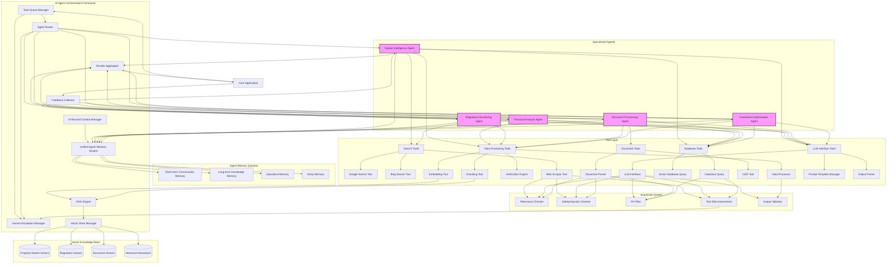
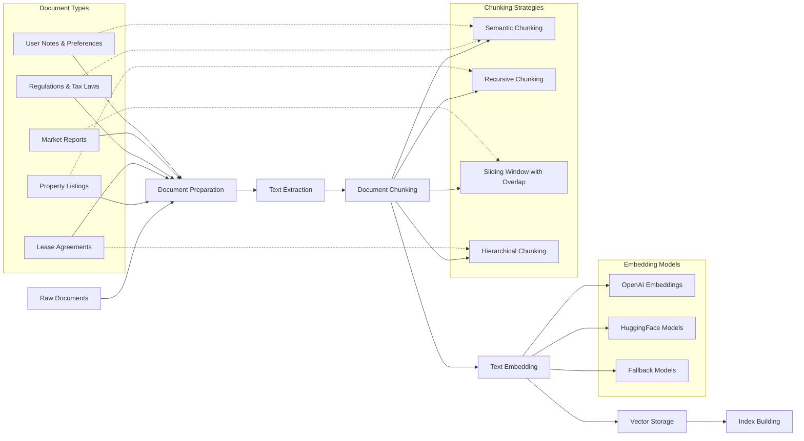
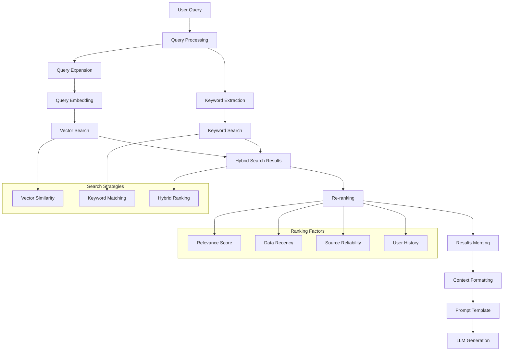
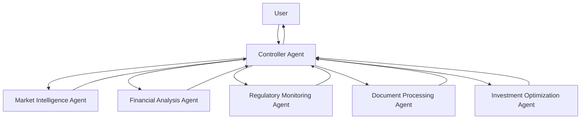
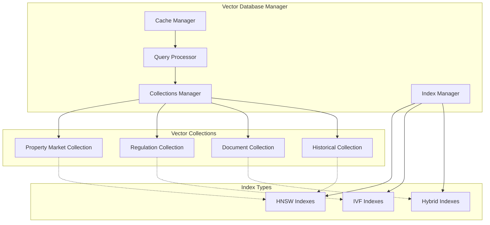
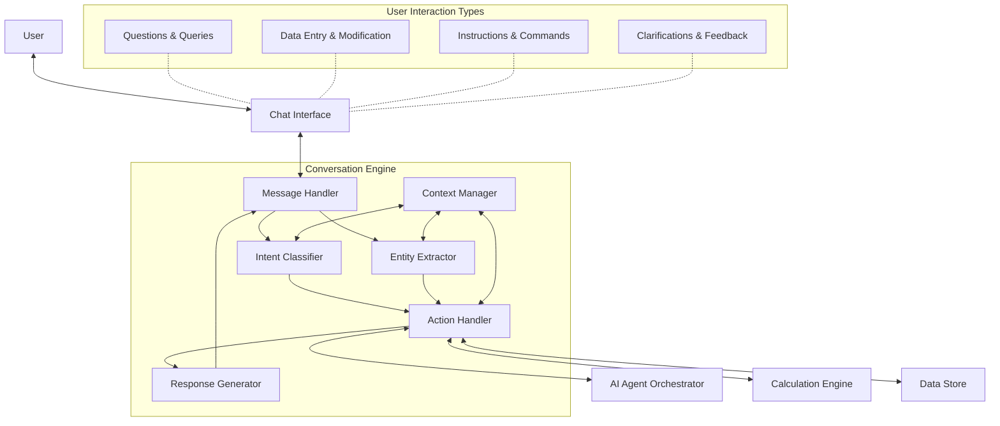

# Revised AI Agent Architecture for Property Investment Application

## 4. Enhanced AI Agent Orchestration



### 4.1 Enhanced Architecture Components

#### 4.1.1 Unified Agent Memory System

The redesigned architecture implements a comprehensive memory system with four distinct components:

1. **Short-term Conversation Memory**
   - Maintains recent interactions and conversation state
   - Uses windowed context to manage token limitations
   - Enables coherent multi-turn interactions

2. **Long-term Knowledge Memory**
   - Persists important information across sessions
   - Vectorized for semantic retrieval
   - Enables agents to build on previous insights

3. **Episodical Memory**
   - Records successful task completions and strategies
   - Enables learning from past approaches
   - Implements spaced repetition for important patterns

4. **Entity Memory**
   - Tracks specific entities (properties, regulations, market conditions)
   - Maintains relationship graphs
   - Provides contextual awareness of entity history

#### 4.1.2 RAG Engine

The RAG (Retrieval-Augmented Generation) Engine enhances agent capabilities by:

1. **Vectorized Knowledge Storage**
   - Converts documents, regulations, and market data into embeddings
   - Organizes embeddings in specialized vector collections
   - Enables semantic search across knowledge domains

2. **Intelligent Chunking**
   - Implements advanced chunking strategies for different document types:
     - Semantic chunking for regulations and legal documents
     - Recursive chunking for property listings and descriptions
     - Sliding window with overlap for longer financial documents
   - Preserves document structure and context

3. **Hybrid Retrieval**
   - Combines keyword search with semantic similarity
   - Implements Re-ranking based on relevance scores
   - Uses query expansion to improve retrieval accuracy

4. **Context Augmentation**
   - Dynamically injects relevant knowledge into LLM prompts
   - Handles context window management
   - Implements compression techniques for fitting more context

#### 4.1.3 Agent Specialization

The redesigned architecture implements five specialized agent types:

1. **Market Intelligence Agent**
   - Focuses on gathering and analyzing market data
   - Monitors property trends, rental rates, and neighborhood changes
   - Implements a tiered search approach with multiple tools

2. **Financial Analysis Agent**
   - Specializes in financial calculations and investment metrics
   - Provides ROI projections and sensitivity analysis
   - Uses advanced LLM reasoning for complex financial scenarios

3. **Regulatory Monitoring Agent**
   - Tracks tax laws, rent control regulations, and zoning rules
   - Uses RAG to maintain current regulatory knowledge
   - Alerts on changes that impact investment properties

4. **Document Processing Agent**
   - Specializes in extracting information from property documents
   - Handles leases, inspection reports, and property listings
   - Converts unstructured document data to structured formats

5. **Investment Optimization Agent**
   - Provides recommendations to improve investment performance
   - Simulates different scenarios and strategies
   - Uses chain-of-thought reasoning for complex suggestions

#### 4.1.4 Tool Layer Enhancements

The tool layer is reorganized into functional categories:

1. **Search Tools**
   - Enhanced with semantic search capabilities
   - Implements rate limiting and fallback strategies
   - Includes targeted scraping for specific data sources

2. **Data Processing Tools**
   - Advanced data validation and normalization
   - Statistical analysis for outlier detection
   - Pattern recognition for trend identification

3. **Document Tools**
   - OCR capabilities for scanned documents
   - Table extraction for structured data
   - Format conversion and standardization

4. **LLM Interface Tools**
   - Model-specific prompt template management
   - Advanced output parsing with structured data extraction
   - Model routing based on task complexity

5. **Database Tools**
   - Unified access to relational and vector databases
   - Caching layer for performance optimization
   - Data versioning and historical access

### 4.2 RAG Implementation Details

#### 4.2.1 Document Processing Pipeline



#### 4.2.2 Retrieval Process



### 4.3 Advanced Agent Patterns

The system implements several advanced agent patterns:

#### 4.3.1 Agent Hierarchy (Manager Pattern)



#### 4.3.2 Chain-of-Thought Prompting

For complex financial reasoning and investment optimization, the system implements chain-of-thought prompting where agents:

1. Break down multi-step problems into logical parts
2. Process each step explicitly
3. Verify intermediate results
4. Combine intermediate steps into comprehensive solutions
5. Explain reasoning with clear audit trails

#### 4.3.3 ReAct (Reasoning + Acting) Pattern

For interactive workflows like property analysis, the system implements a ReAct pattern where:

1. Agents reason about current state
2. Decide on next actions based on reasoning
3. Execute actions and observe results
4. Incorporate results into updated reasoning
5. Continue the cycle until task completion

### 4.4 Vector Database Integration

#### 4.4.1 Vector Collections Organization

The vector database is organized into specialized collections:

1. **Property Market Vectors**
   - Property listings and characteristics
   - Neighborhood and market trend data
   - Comparable property records

2. **Regulation Vectors**
   - Tax laws and regulations
   - Rent control provisions
   - Zoning and land use requirements

3. **Document Vectors**
   - Lease agreements
   - Inspection reports
   - Property listings
   - Financial statements

4. **Historical Interactions**
   - Previous user questions and agent responses
   - Successful analysis patterns
   - User preferences and priorities

#### 4.4.2 Vector Storage Implementation



### 4.5 Conversational Interface

The application implements a natural language chat interface that serves as the primary interaction method for users. This interface enables seamless communication with the AI agent system while maintaining the power of the underlying financial analysis capabilities.



#### 4.5.1 Conversation Engine Components

**Message Handler:**
- Processes incoming and outgoing messages
- Manages conversation flow and turn-taking
- Handles message queuing and prioritization
- Implements typing indicators and response chunking

**Intent Classifier:**
- Identifies user intent from natural language input
- Classifies messages into functional categories:
  * Property information queries
  * Market data requests
  * Financial analysis commands
  * Data entry and modification
  * Clarification questions
  * Report generation requests
- Maps intents to specific agent capabilities and actions

**Entity Extractor:**
- Identifies key entities from user messages:
  * Property characteristics (address, size, type)
  * Financial parameters (prices, rates, periods)
  * Timeframes and dates
  * Locations and neighborhoods
  * Comparison requests
- Extracts structured data from conversational input

**Context Manager:**
- Maintains conversation history and state
- Resolves pronouns and references to previous entities
- Tracks current focus of conversation
- Manages multi-turn interactions for complex tasks

**Action Handler:**
- Translates intents and entities into system actions
- Routes requests to appropriate specialized agents
- Triggers calculation engine for financial operations
- Manages database operations for data retrieval and storage

**Response Generator:**
- Creates natural language responses from system outputs
- Adapts complexity to user's expertise level
- Formats numerical data for conversational presentation
- Generates follow-up questions and suggestions

#### 4.5.2 Conversational Interaction Patterns

**Property Data Entry:**
```
User: "I'm looking at a 3-bedroom apartment in Berlin Kreuzberg for €450,000."
System: "Great! I've recorded a 3-bedroom apartment in Berlin Kreuzberg with a purchase price of €450,000. What's the approximate size in square meters?"
User: "It's about 95 square meters."
System: "Thanks. Based on recent sales in Kreuzberg, €450,000 for a 95m² apartment is within the market range (€4,736/m²). Would you like to enter more details or see a preliminary analysis?"
```

**Financial Query Handling:**
```
User: "What would my monthly payment be with 20% down and a 2.5% interest rate?"
System: "Based on your property (€450,000 in Kreuzberg):
- 20% down payment: €90,000
- Loan amount: €360,000
- At 2.5% interest with a 30-year term:
  * Monthly payment: ~€1,423
  * Including estimated property tax and insurance: ~€1,650

Would you like to see how this affects your cash flow or try different financing terms?"
```

**Comparative Analysis:**
```
User: "How does this compare to other properties in the area?"
System: "Analyzing comparable properties in Kreuzberg...

Your property (€450,000, 95m², 3BR):
- Price per m²: €4,736

Recent comparable sales in Kreuzberg (last 6 months):
- Average 3BR apartment: €489,000 (€4,850/m²)
- Price range: €420,000 - €545,000
- Your property is priced 2.4% below the average for similar units

Would you like to see a detailed comparison or analyze potential rental income?"
```

**Document Analysis Request:**
```
User: "I have the inspection report. Can you analyze it for me?"
System: "I'd be happy to analyze the inspection report. You can upload it by clicking the attachment button below or drag and drop the file."
User: [Uploads PDF document]
System: "Thanks! I'm analyzing the inspection report now... 

Key findings:
- Building condition: Good overall, built in 1985, renovated in 2012
- Heating system: 8 years old, expected to need replacement in ~7 years (€8,000-12,000)
- Windows: Double-glazed, good condition
- Roof: Some minor repairs needed within 2-3 years (€2,000-3,000)
- Electrical system: Updated during 2012 renovation, no issues noted

Would you like me to estimate the capital expenditure reserves needed based on this report?"
```

**Market Analysis:**
```
User: "What's the rental market like in this area?"
System: "Analyzing the rental market in Berlin Kreuzberg...

For a 95m² 3-bedroom apartment in Kreuzberg:
- Average current rent: €18-22/m² (€1,710-2,090/month)
- Vacancy rate: 1.2% (very low)
- Rental trend: +3.8% annually over the past 3 years
- New regulation alert: Berlin's rent control ("Mietpreisbremse") limits new rental contracts to 10% above local comparative rent

Based on your property's characteristics, the estimated monthly rental income would be €1,850-1,950.

Would you like more details about the neighborhood trends or rent control regulations?"
```

#### 4.5.3 Conversational Guardrails

In addition to the system-level guardrails, the conversational interface implements specific safeguards:

**Input Verification:**
- Confirms critical data with the user before processing
- Repeats unusual values to ensure accuracy
- Flags implausible inputs with suggested corrections

**Conversation Focusing:**
- Gently redirects off-topic queries to property investment subjects
- Maintains conversation coherence across multiple topics
- Breaks complex analyses into manageable interactions

**Clarification Mechanisms:**
- Proactively asks for clarification on ambiguous inputs
- Provides examples when requesting specific information
- Offers multiple-choice options for complex decisions

**Explanation Capabilities:**
- Automatically explains complex financial terms
- Provides reasoning behind recommendations
- Offers detail levels appropriate to user expertise

### 4.6 Guardrails Implementation

The system implements comprehensive guardrails at multiple levels:

#### 4.6.1 Input Guardrails

- Validates user inputs for consistency and reasonableness
- Checks property metrics against market ranges
- Flags implausible financial assumptions
- Detects potentially erroneous data

#### 4.6.2 Search Guardrails

- Ensures relevance of search queries to property investment
- Prevents scope creep in data collection
- Validates source reliability and authoritativeness
- Implements rate limiting and cost controls

#### 4.6.3 Analysis Guardrails

- Detects unrealistic financial projections
- Flagships implausible recommendations
- Requires confidence thresholds for high-impact advice
- Implements fact-checking on critical assertions

#### 4.6.4 Output Guardrails

- Validates consistency between numerical and textual outputs
- Ensures recommendations are actionable and clear
- Adds appropriate disclaimers for financial advice
- Verifies that outputs match user expertise level

## 7.2 Enhanced AI Agent Requirements

### 7.2.1 Market Intelligence Agent

| **Requirement ID** | **Description** | **User Story** | **Enhanced Implementation Details** |
|-------------------|-----------------|----------------|-------------------------------------|
| **AI-001** | Market Data Collection | As an investor, I want comprehensive market data for my target location. | **RAG Enhancement:** <br>- Implements hybrid retrieval combining semantic search with keyword matching<br>- Stores market data as vector embeddings with metadata for efficient retrieval<br>- Uses chain-of-thought prompting to determine most relevant search queries<br><br>**Advanced Chunking:** <br>- Market reports chunked using sliding window with overlap<br>- Property listings chunked using recursive strategy with metadata preservation<br>- Neighborhood data chunked using hierarchical approach<br><br>**Memory Integration:** <br>- Maintains entity memory for locations with historical trends<br>- Episodical memory records successful search strategies<br>- Uses self-consistency validation across multiple sources<br><br>**Model Selection:** <br>- Uses smaller, efficient models for initial search and extraction<br>- Escalates to more capable models for trend analysis and pattern recognition<br><br>**Tools Used:** <br>- Google Search Tool, Bing Search Tool, Web Scraper Tool<br>- Vector Database Query Tool, Data Processor Tool<br>- Document Parser Tool, LLM Interface Tool |
| **AI-001.1** | Competitive Market Analysis | As an investor, I want to understand how my property compares to similar properties in the area. | **Implementation:** <br>- Implements ReAct pattern for iterative property comparison<br>- Uses vector similarity to find truly comparable properties<br>- Analyzes price per square meter, amenities, and condition ratings<br>- Provides visual comparison charts with relativity metrics<br>- Explains key differentiators that affect valuation<br>- Identifies opportunities for competitive advantage<br><br>**Advanced Features:** <br>- Time-series analysis of comparable property trends<br>- Geographic visualization of property positions<br>- Feature-based comparison matrix<br>- Price sensitivity analysis based on feature differences |
| **AI-001.2** | Neighborhood Trend Analysis | As an investor, I want insights into neighborhood development trends and future potential. | **Implementation:** <br>- Uses structured RAG with specialized regulation and development planning vectors<br>- Implements multi-source verification for development claims<br>- Analyzes historical property value trends with regression models<br>- Identifies gentrification indicators and investment cycles<br>- Monitors construction permits and commercial development<br>- Evaluates transportation and infrastructure improvements<br><br>**Advanced Features:** <br>- Demographic shift analysis<br>- Infrastructure development tracking<br>- Business establishment patterns<br>- School quality and crime rate trends |

### 7.2.2 Financial Analysis Agent

| **Requirement ID** | **Description** | **User Story** | **Enhanced Implementation Details** |
|-------------------|-----------------|----------------|-------------------------------------|
| **AI-002** | Investment Analysis | As an investor, I want comprehensive financial analysis of my potential property investment. | **RAG Enhancement:** <br>- Uses specialized financial knowledge vectors for calculation methodologies<br>- Implements hybrid retrieval for financial regulations and standards<br>- Maintains vector embeddings of successful analysis patterns<br><br>**Chain-of-Thought Implementation:** <br>- Breaks down complex financial calculations with explicit reasoning<br>- Shows step-by-step derivation of key metrics<br>- Validates intermediate results against expected ranges<br>- Explains implications of financial ratios and metrics<br><br>**Tool Integration:** <br>- Data Processor Tool for complex calculations<br>- Verification Engine for result validation<br>- LLM Interface for explanation generation<br>- Database Query for historical comparison<br><br>**Model Selection:** <br>- Uses specialized financial analysis models<br>- Capable models for explaining complex financial concepts<br><br>**Advanced Features:** <br>- Monte Carlo simulations for risk assessment<br>- Sensitivity analysis across multiple variables<br>- Scenario modeling for market changes<br>- Benchmark comparison with investment alternatives |
| **AI-002.1** | Cash Flow Projection | As an investor, I want detailed cash flow projections over the investment lifecycle. | **Implementation:** <br>- Implements advanced time-series modeling for cash flow projection<br>- Uses entity memory to track property-specific financial assumptions<br>- Considers seasonal variations in certain expense categories<br>- Models maintenance reserve requirements based on property age and condition<br>- Factors in vacancy rate patterns based on unit type and location<br>- Projects income and expense growth with variable inflation rates<br><br>**Advanced Features:** <br>- Visualization of monthly and annual cash flows<br>- Cumulative cash flow analysis<br>- Break-even point identification<br>- Cash-on-cash return projections by year |
| **AI-002.2** | Tax Optimization | As an investor, I want to understand tax implications and optimization strategies. | **Implementation:** <br>- Uses RAG with specialized tax regulation vectors<br>- Implements entity memory for jurisdiction-specific tax rules<br>- Simulates depreciation schedules with different approaches<br>- Analyzes expense categorization for optimal tax treatment<br>- Identifies timeline-sensitive tax strategies<br>- Models impact of property improvements on tax basis<br><br>**Advanced Features:** <br>- Depreciation optimization models<br>- Tax-loss harvesting opportunities<br>- Entity structure recommendations<br>- Cross-border tax implications for international investors |

### 7.2.3 Regulatory Monitoring Agent

| **Requirement ID** | **Description** | **User Story** | **Enhanced Implementation Details** |
|-------------------|-----------------|----------------|-------------------------------------|
| **AI-003** | Regulation Tracking | As an investor, I want to stay informed about regulatory changes affecting my property investments. | **RAG Enhancement:** <br>- Specialized vector collection for regulations with temporal metadata<br>- Implements diff-based change detection between regulation versions<br>- Uses semantic chunking for legal documents with hierarchical preservation<br><br>**Vector Search Implementation:** <br>- Hybrid search combining exact citation matching with semantic similarity<br>- Jurisdictional filtering using geospatial metadata<br>- Temporal relevance ranking for most current regulations<br><br>**Memory Integration:** <br>- Entity memory for tracking specific regulations and their history<br>- Relationship tracking between regulations and property characteristics<br>- Episodical memory of regulatory impact patterns<br><br>**Tools Used:** <br>- Specialized legal document scrapers for official sources<br>- Document comparison tools for change detection<br>- Structured output parsing for regulatory parameters<br>- Alert generation system with priority levels |
| **AI-003.1** | Rent Regulation Compliance | As an investor, I want to ensure my rental strategy complies with local regulations. | **Implementation:** <br>- Specialized RAG implementation for rent control regulations<br>- Jurisdiction-specific rule application based on property location<br>- Automatic detection of rent increase limitations<br>- Compliance checking for lease terms and conditions<br>- Tenant rights analysis for different unit types<br>- Eviction restriction monitoring and notification<br><br>**Advanced Features:** <br>- Rent control calculator with legal limits<br>- Compliance checklist generation<br>- Notification system for regulation changes<br>- Risk assessment for non-compliance |
| **AI-003.2** | Zoning and Land Use Monitoring | As an investor, I want to understand zoning restrictions and opportunities for my properties. | **Implementation:** <br>- Uses RAG with specialized zoning document vectors<br>- Implements geospatial filtering for location-specific regulations<br>- Monitors city planning updates and zoning hearings<br>- Analyzes historical zoning changes for trend identification<br>- Assesses density allowances and building restrictions<br>- Identifies potential variance or rezoning opportunities<br><br>**Advanced Features:** <br>- Buildable area calculation<br>- Development potential assessment<br>- Use restriction analysis<br>- Zoning change prediction |

### 7.2.4 Document Processing Agent

| **Requirement ID** | **Description** | **User Story** | **Enhanced Implementation Details** |
|-------------------|-----------------|----------------|-------------------------------------|
| **AI-004** | Document Analysis | As an investor, I want to extract relevant information from property documents automatically. | **RAG Enhancement:** <br>- Specialized vector embeddings for document types and templates<br>- Implements layout-aware document chunking for maintaining structure<br>- Uses document structure vectors to identify relevant sections<br><br>**Document Processing Pipeline:** <br>- OCR with layout preservation for scanned documents<br>- Table extraction and normalization for structured data<br>- Form field identification and data extraction<br>- Entity recognition for names, dates, and amounts<br><br>**Advanced Parsing:** <br>- Contract clause classification and extraction<br>- Condition assessment from inspection reports<br>- Financial figure extraction with validation<br>- Timeline and deadline identification<br><br>**Tools Used:** <br>- OCR Tool for scanned document processing<br>- Document Parser Tool with template matching<br>- Table Extraction Tool for structured data<br>- Entity Recognition Tool for key information<br>- PII Filtering Tool for sensitive data management |
| **AI-004.1** | Lease Agreement Analysis | As an investor, I want comprehensive analysis of existing lease agreements. | **Implementation:** <br>- Specialized RAG implementation for lease document understanding<br>- Hierarchical chunking preserving lease structure and sections<br>- Automatic extraction of key lease parameters:<br>  * Rent amount and escalation clauses<br>  * Term duration and renewal options<br>  * Security deposit amounts and conditions<br>  * Maintenance responsibilities<br>  * Utility payment structures<br>  * Special clauses and restrictions<br>- Lease compliance checking against current regulations<br>- Identification of potentially problematic clauses<br><br>**Advanced Features:** <br>- Lease comparison against standard templates<br>- Risk assessment for unusual provisions<br>- Revenue projection based on lease terms<br>- Renewal opportunity timeline |
| **AI-004.2** | Inspection Report Interpretation | As an investor, I want clear understanding of property condition from technical reports. | **Implementation:** <br>- Uses RAG with specialized building component knowledge<br>- Implements entity recognition for building systems and elements<br>- Extracts condition ratings and estimated remaining useful life<br>- Categorizes issues by severity and urgency<br>- Estimates repair costs based on identified issues<br>- Prioritizes maintenance items with timeline recommendations<br><br>**Advanced Features:** <br>- Capital expenditure planning based on report findings<br>- Maintenance reserve recommendations<br>- Visualization of property condition by component<br>- Comparison to typical condition for property age |

### 7.2.5 Investment Optimization Agent

| **Requirement ID** | **Description** | **User Story** | **Enhanced Implementation Details** |
|-------------------|-----------------|----------------|-------------------------------------|
| **AI-005** | Investment Optimization | As an investor, I want actionable recommendations to improve returns. | **RAG Enhancement:** <br>- Specialized vector collection for optimization strategies<br>- Implements retrieval of similar property case studies<br>- Uses adaptive RAG with dynamic context selection<br><br>**Chain-of-Thought Reasoning:** <br>- Explicit multi-step reasoning for optimization opportunities<br>- Counterfactual analysis of different strategies<br>- Trade-off assessment between strategies<br>- Quantification of potential impacts<br><br>**Tree of Thoughts Implementation:** <br>- Explores multiple strategic paths simultaneously<br>- Evaluates multiple optimization dimensions:<br>  * Financing optimization<br>  * Rental income maximization<br>  * Expense reduction<br>  * Tax strategy optimization<br>  * Value-add opportunities<br>- Prunes ineffective paths based on constraint satisfaction<br><br>**Tools Used:** <br>- Data Processor Tool for scenario simulation<br>- LLM Interface Tool for strategy reasoning<br>- Database Query Tool for comparable case retrieval<br>- Verification Engine for recommendation validation |
| **AI-005.1** | Financing Optimization | As an investor, I want to optimize my financing structure for maximum returns. | **Implementation:** <br>- Implements ReAct pattern for iterative financing scenario testing<br>- Uses entity memory to track user's financial parameters and preferences<br>- Simulates multiple loan products and structures:<br>  * Fixed vs. variable rate impacts<br>  * Term length optimization<br>  * Down payment optimization<br>  * Refinancing opportunity analysis<br>  * Loan program qualification assessment<br>- Calculates leverage efficiency metrics<br>- Considers tax implications of different financing structures<br><br>**Advanced Features:** <br>- Interest rate sensitivity analysis<br>- Refinancing breakeven calculator<br>- Amortization optimization<br>- Cash-out refinancing strategy assessment |
| **AI-005.2** | Value-Add Strategy Recommendation | As an investor, I want to identify opportunities to increase property value. | **Implementation:** <br>- Uses RAG with renovation and improvement case studies<br>- Implements chain-of-thought assessment of property enhancement opportunities:<br>  * Unit renovation potential<br>  * Common area improvements<br>  * Energy efficiency upgrades<br>  * Additional amenity opportunities<br>  * Repositioning strategies<br>- Prioritizes improvements by ROI and implementation difficulty<br>- Models rent increase potential for each improvement<br>- Estimates cost ranges with confidence intervals<br><br>**Advanced Features:** <br>- Renovation ROI calculator<br>- Market positioning analysis<br>- Tenant demographic targeting<br>- Implementation timeline planning |

### 7.2.6 Conversational Interface Agent

| **Requirement ID** | **Description** | **User Story** | **Enhanced Implementation Details** |
|-------------------|-----------------|----------------|-------------------------------------|
| **AI-006** | Natural Language Interface | As an investor, I want to interact with the system through natural conversation. | **RAG Enhancement:** <br>- Uses conversation history as additional context for RAG<br>- Retrieves similar past conversations for context<br>- Maintains vector embeddings of conversation flows<br><br>**Dialog Management:** <br>- Implements a stateful dialog manager for conversation tracking<br>- Identifies multi-turn intents across conversation history<br>- Manages context window effectively for longer conversations<br>- Handles topic transitions gracefully<br><br>**Entity Tracking:** <br>- Maintains entity registry across conversation<br>- Resolves pronouns to correct entities<br>- Tracks modifications to previously mentioned values<br>- Identifies ambiguities requiring clarification<br><br>**Tools Used:** <br>- Intent Classification Tool<br>- Entity Extraction Tool<br>- Dialog State Manager<br>- Natural Language Generation Tool |
| **AI-006.1** | Conversational Data Entry | As an investor, I want to provide property details through natural conversation. | **Implementation:** <br>- Extracts property-related entities from conversational text<br>- Confirms extracted information with user<br>- Prompts for missing critical information<br>- Handles corrections and updates gracefully<br>- Manages multiple properties in conversation context<br>- Detects ambiguities and requests clarification<br><br>**Natural Language Understanding:** <br>- Extracts numerical values with units<br>- Recognizes property types and characteristics<br>- Identifies locations and addresses<br>- Understands temporal references<br>- Handles comparative statements<br><br>**Example Dialog Flow:** <br>User: "I'm looking at a duplex in Frankfurt for €680,000."<br>System: "I've recorded a duplex property in Frankfurt with a purchase price of €680,000. Can you tell me the total size and how many units it has?"<br>User: "It's 210 square meters with two 2-bedroom units."<br>System: "Thanks! I've updated your property details. Would you like to enter information about the current rental income or shall I estimate it based on the Frankfurt market?" |
| **AI-006.2** | Natural Language Analysis Queries | As an investor, I want to ask questions about my investment in everyday language. | **Implementation:** <br>- Classifies analytical query types:<br>  * Profitability questions<br>  * Comparison requests<br>  * Risk assessments<br>  * Market queries<br>  * Optimization requests<br>- Decomposes complex questions into sub-queries<br>- Translates natural language into calculation parameters<br>- Regenerates natural answers from numerical results<br><br>**Advanced Query Handling:** <br>- Handles hypothetical scenarios ("What if the interest rate was 3%?")<br>- Processes comparative queries ("How does this compare to my other property?")<br>- Manages temporal questions ("What will cash flow be in 5 years?")<br>- Supports analytical questions ("Is this a good investment?")<br><br>**Example Dialog Flow:** <br>User: "What would happen to my cash flow if I renovated the kitchen and bathroom for €25,000?"<br>System: "Based on market data for Frankfurt luxury renovations, investing €25,000 in kitchen and bathroom upgrades could increase your rental income by approximately €150-200 per month per unit. With two units, this represents an annual increase of €3,600-4,800. At this rate, your renovation would pay for itself in about 5.2-6.9 years. Your monthly cash flow would increase from €320 to €470-520 after accounting for the renovation loan costs. Would you like to see a detailed breakdown of this analysis?" |
| **AI-006.3** | Multi-modal Communication | As an investor, I want to interact through text, voice, and visuals in the conversation. | **Implementation:** <br>- Accepts and processes multiple input types:<br>  * Text messages<br>  * Voice inputs (with transcription)<br>  * Document uploads<br>  * Image captures of properties or documents<br>- Generates appropriate response formats:<br>  * Conversational text responses<br>  * Visual charts and graphs for financial data<br>  * Interactive calculators embedded in conversation<br>  * Comparative tables for market analysis<br><br>**Media Handling:** <br>- Processes uploaded property images for context<br>- Extracts information from photographed documents<br>- Generates visualization charts within conversation<br>- Creates downloadable reports from conversation<br><br>**Example Dialog Flow:** <br>User: [Uploads photo of property]<br>System: "Thanks for sharing the property image. I can see it's a traditional German Altbau style building with approximately 4-5 floors. Based on the architectural style and façade condition, it appears to be from the early 1900s but well-maintained. Would you like me to estimate renovation needs based on similar properties of this era, or do you have more specific information about its condition?" |

### 7.