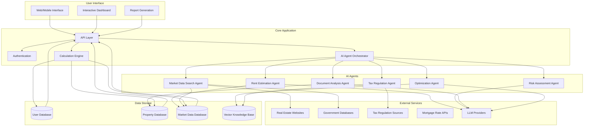
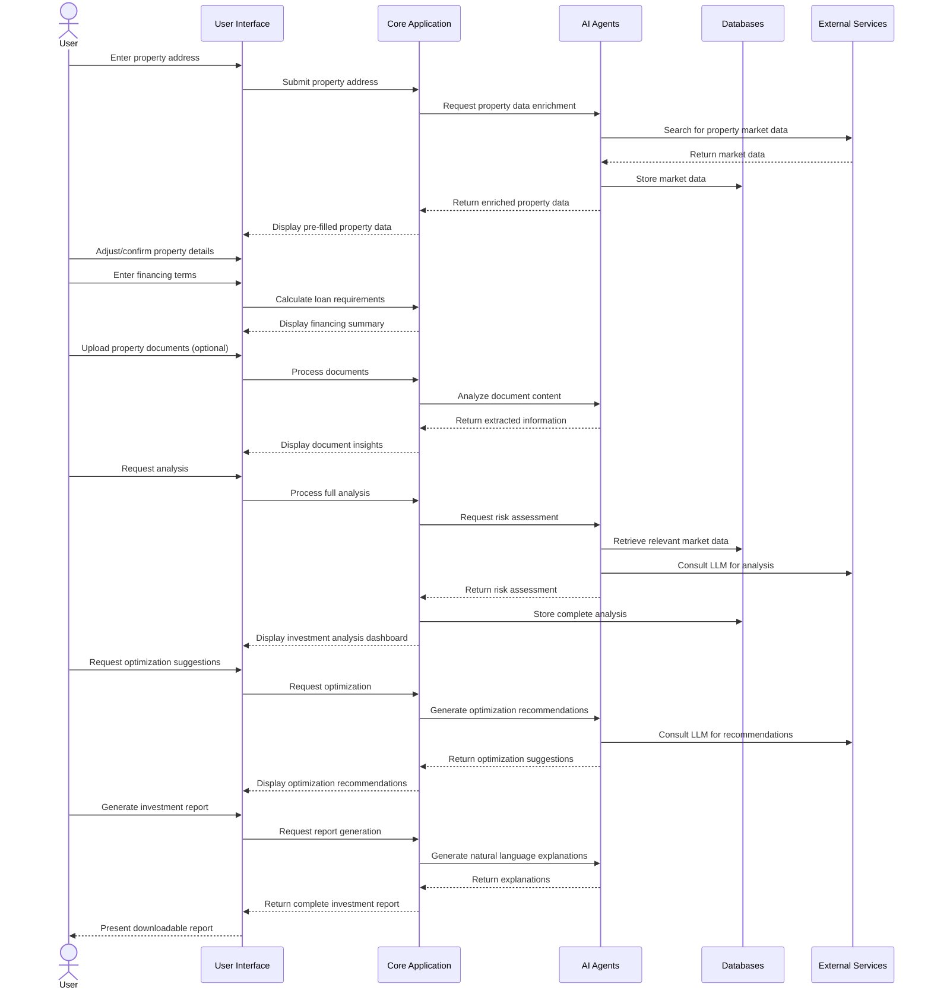
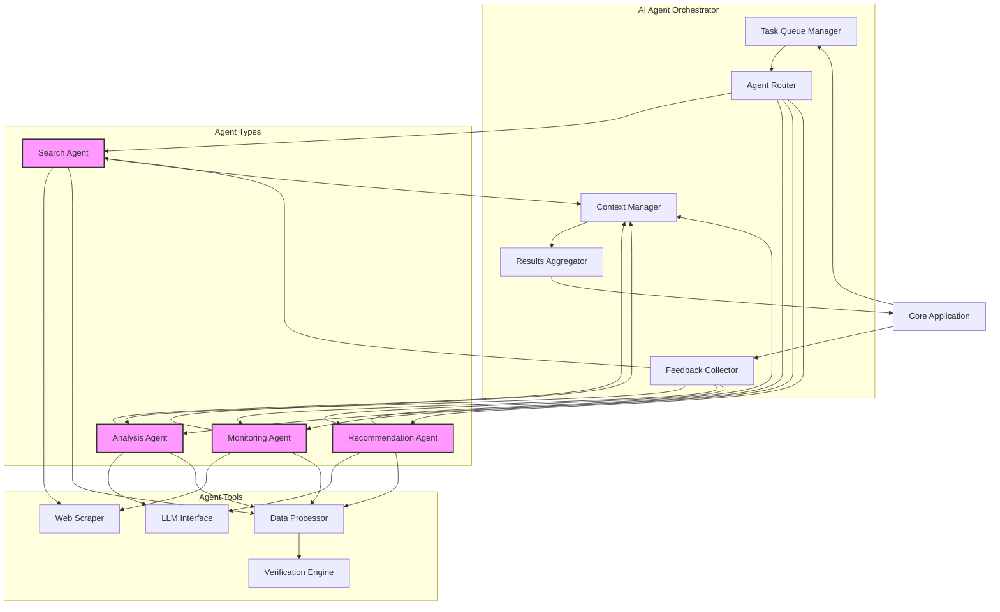
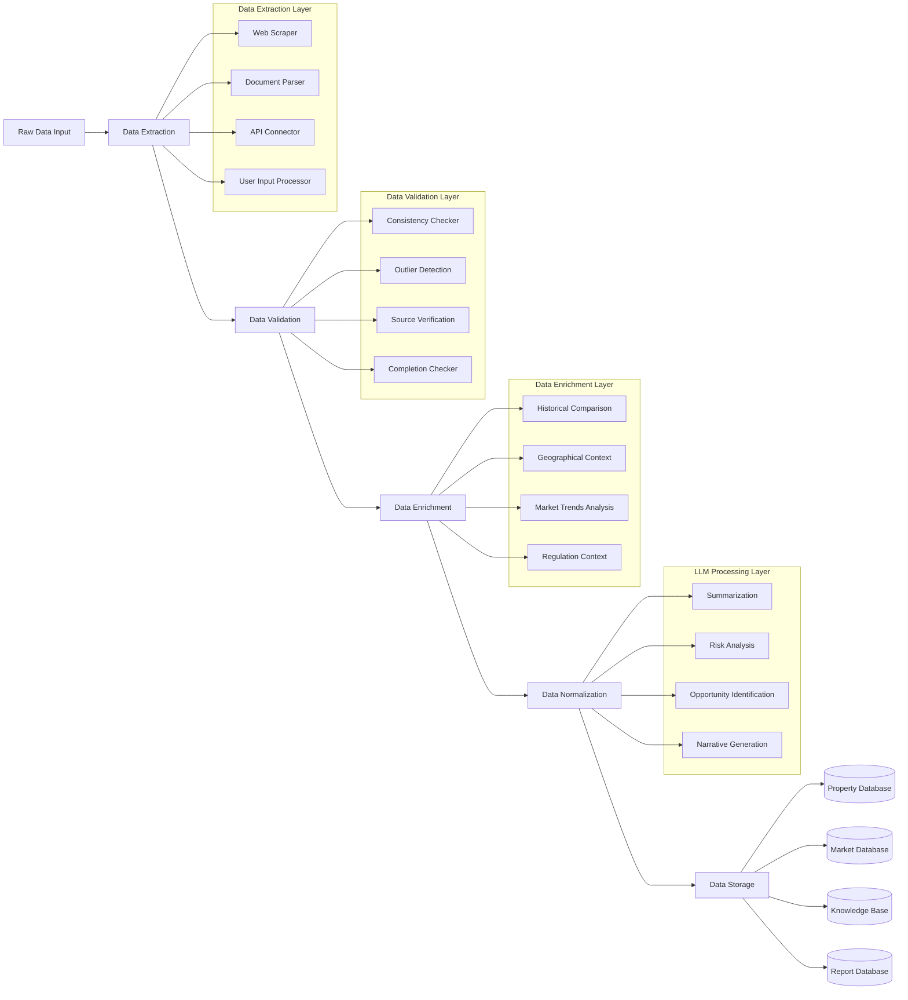
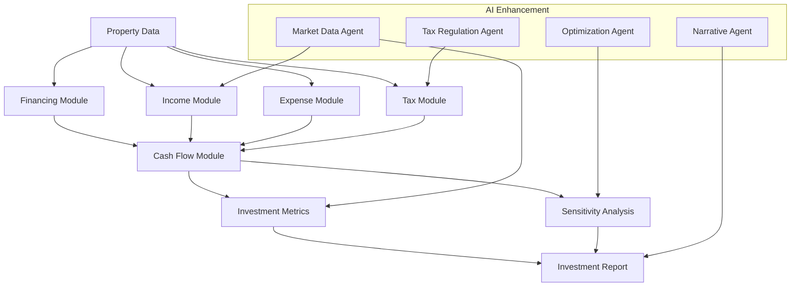

# Property Investment Analysis Application
## Project Requirements Document

**Version:** 1.0  
**Date:** April 25, 2025  
**Author:** Ali Bina

---

## Executive Summary

This document outlines the comprehensive requirements for a Property Investment Analysis Application with integrated AI capabilities. The application aims to automate and enhance the process of evaluating property investments by providing accurate financial projections, real-time market data, and intelligent analysis. The system leverages advanced AI agents to collect market information, analyze investment potential, monitor regulatory changes, and generate insights in natural language.

---

## 1. Project Overview

### 1.1 Purpose

The Property Investment Analysis Application will serve as a comprehensive tool for real estate investors to evaluate potential property investments. The application will automate complex calculations, retrieve current market data, and provide intelligent analysis to support informed investment decisions.

### 1.2 Scope

The application will include:
- Property data management
- Financial calculation engine
- AI-powered market data collection
- Intelligent investment analysis
- Document processing capabilities
- Reporting and visualization tools
- User account management

### 1.3 Target Users

- Individual property investors
- Professional real estate investors
- Investment advisors
- Property portfolio managers
- Real estate investment firms

---

## 2. System Architecture Overview

---

## 3. User Workflow

---

## 4. AI Agent Orchestration

---

## 5. Data Processing Pipeline

---

## 6. Calculation Engine Flow

---

## 7. Detailed Requirements

### 7.1 Core Application Requirements

| **Requirement ID** | **Description** | **User Story** | **Expected Behavior/Outcome** |
|-------------------|-----------------|----------------|------------------------------|
| **FR-001** | Property Data Input | As a property investor, I want to enter basic property details so that I can analyze its investment potential. | The system should provide input fields for property address, purchase price, property type, year built, size in square meters, number of units, and condition assessment. Data validation ensures numbers are within reasonable ranges. |
| **FR-002** | Purchase Cost Calculator | As an investor, I want to calculate total acquisition costs including closing fees so I understand the full initial investment. | When a user enters the purchase price, the system automatically calculates estimated closing costs (notary, tax, agent fees) based on regional standards. User can override with actual figures. Total acquisition cost updates automatically. |
| **FR-003** | Financing Details | As an investor, I want to input my financing structure so I can understand my loan requirements. | User can enter available cash, desired down payment, and receive calculations for loan amount needed. System should validate that down payment meets minimum requirements (e.g., covers closing costs plus bank's minimum percentage). |
| **FR-004** | Mortgage Payment Calculator | As an investor, I want to calculate my monthly mortgage payments based on various financing terms. | System calculates monthly payments using input loan amount, interest rate, repayment rate (Tilgung), and term. Calculations should show amortization schedule with interest-principal breakdown for each year. |
| **FR-005** | Multi-Unit Rental Structure | As an investor buying a multi-unit building, I want to input details for each unit independently. | System allows adding information for multiple units (occupied/vacant status, size, current rent, potential rent, lease terms). Each unit should be stored separately with its own attributes. |
| **FR-006** | Rental Income Projections | As an investor, I want to estimate potential rental income for vacant units based on local market data. | System should calculate potential rent based on unit size, features, and location using either manual input or integration with rent index data (Mietspiegel). Should flag if estimated rent exceeds legal limits (Mietpreisbremse). |
| **FR-007** | Operating Expenses Calculation | As an investor, I want to estimate all recurring expenses to determine net operating income. | System calculates all regular expenses including property tax, insurance, non-recoverable maintenance costs, property management, and a reserve fund. Expenses should be calculated both as fixed amounts and as percentages of gross income for sensitivity analysis. |
| **FR-008** | Tax Benefit Calculator | As an investor, I want to estimate my tax benefits from property depreciation and expenses. | System calculates depreciation (AfA) based on building value (excluding land value), mortgage interest deductions, and other qualifying expenses. Tax benefit is calculated using user's marginal tax rate to show annual and monthly tax savings. |
| **FR-009** | Cash Flow Analysis | As an investor, I want to see detailed monthly and annual cash flow projections. | System generates comprehensive cash flow statement showing all income sources and expenses, with monthly and annual views. Cash flow before and after tax benefits should be clearly displayed. |
| **FR-010** | Personal Affordability Assessment | As an investor, I want to evaluate if I can personally afford this investment given my other financial obligations. | User can input personal income, existing debt obligations, and living expenses. System compares total income to total expenses including the new investment to provide affordability assessment with safety margin calculations. |

### 7.2 AI Agent Requirements

| **Requirement ID** | **Description** | **User Story** | **Expected Behavior/Outcome** |
|-------------------|-----------------|----------------|------------------------------|
| **AI-001** | Market Data Search Agent | As an investor, I want the system to automatically gather up-to-date market data for my target location. | The system deploys a search agent that crawls real estate websites, government databases, and market reports to collect current rental rates, property values, vacancy rates, and market trends specific to the property's location and type. Data should be timestamped, sources cited, and confidence levels indicated. |
| **AI-002** | Rent Estimation Agent | As an investor, I want accurate rent estimates for vacant units based on current market conditions. | LLM agent analyzes collected market data along with property specifics (size, features, condition) to generate rental estimates. Agent explains reasoning, cites comparable properties, and provides a range (low/medium/high) rather than a single value. System flags potential Mietpreisbremse violations. |
| **AI-003** | Tax Regulation Monitoring Agent | As an investor, I want to ensure my tax calculations reflect current regulations. | Agent monitors official tax regulation sources and updates the system's tax calculation rules when changes occur. Notifies users when tax law changes might impact their existing analyses with an explanation of the potential effects. |
| **AI-004** | Property Description Analysis | As an investor, I want to extract relevant investment parameters from property listings or descriptions. | When a user pastes a property description text, the LLM agent extracts key information (size, units, condition, current rents) and populates the appropriate fields. Agent identifies missing critical information and prompts user to provide it. |
| **AI-005** | Investment Risk Assessment Agent | As an investor, I want an AI-powered assessment of investment risks and opportunities. | LLM agent analyzes complete property profile and market conditions to identify specific risks (vacancy, regulation changes, interest rate sensitivity) and opportunities (appreciation potential, rental growth). Provides qualitative analysis with confidence levels for each factor. |
| **AI-006** | Market Trend Analysis Agent | As an investor, I want insights on neighborhood and market trends that might affect my investment. | Agent processes historical market data and recent news to identify trends in the property's neighborhood (gentrification, development projects, demographic shifts) and presents findings with citations, explaining potential impact on property values and rental rates. |
| **AI-007** | Mortgage Rate Monitoring Agent | As an investor, I want to be alerted about favorable financing opportunities. | Agent monitors current mortgage rates from multiple lenders and alerts users when rates decrease significantly or when special financing programs become available that match their investment profile. Provides direct comparisons to current financing terms. |
| **AI-008** | Optimization Recommendation Agent | As an investor, I want AI-powered suggestions to optimize my investment returns. | After analyzing complete property data, agent suggests specific optimizations (refinancing, renovation priorities, rent adjustments) with projected impact on ROI and cash flow. Suggestions include implementation cost estimates and expected benefit timeframes. |
| **AI-009** | Document Analysis Agent | As an investor, I want to extract relevant information from property documents like leases and inspection reports. | When user uploads property documents, LLM agent extracts key information (lease terms, reported issues, legal constraints) and integrates findings into the analysis. Highlights discrepancies between document content and user-entered data. |
| **AI-010** | Reporting and Explanation Agent | As an investor, I want clear explanations of complex analyses in natural language. | LLM agent generates natural language explanations of analysis results, focusing on key insights and decision factors. Explanations adapt to user's demonstrated financial literacy level and highlight factors most relevant to stated investment goals. |

### 7.3 Technical Implementation Requirements

| **Requirement ID** | **Description** | **User Story** | **Expected Behavior/Outcome** |
|-------------------|-----------------|----------------|------------------------------|
| **TI-001** | Agent Orchestration Framework | As a developer, I need a system to coordinate multiple AI agents working on different tasks. | Python-based orchestration framework (using LangChain or similar) that manages agent task queues, coordinates information sharing between agents, handles sequential and parallel processing, and provides unified logging and monitoring. Framework must gracefully handle agent failures without disrupting the entire system. |
| **TI-002** | Web Scraping Infrastructure | As a system administrator, I need reliable infrastructure for collecting market data from diverse web sources. | Python-based scraping framework using libraries like Scrapy or Selenium with proxy rotation, rate limiting, and error handling. System must respect robots.txt, implement ethical scraping practices, and maintain a database of scraping patterns for common real estate data sources that can be updated without code changes. |
| **TI-003** | LLM Integration Architecture | As a developer, I need flexible integration with multiple LLM providers. | Abstraction layer that allows switching between different LLM providers (OpenAI, Anthropic, open-source models) with standardized input/output formats. System should implement efficient prompt engineering, context management, and token optimization. Includes fallback mechanisms if primary LLM service is unavailable. |
| **TI-004** | Agent Learning System | As a user, I want agents to improve based on my feedback and corrections. | Feedback collection system where users can rate agent outputs and provide corrections. System stores these interactions to improve future responses through fine-tuning or retrieval-augmented generation. Learning should be both user-specific and contribute to global improvement where appropriate. |
| **TI-005** | Data Verification System | As a user, I want confidence that agent-collected data is accurate and current. | Multi-layered verification system that cross-references data from multiple sources, flags inconsistencies, and assigns confidence scores. System should distinguish between factual data (e.g., official property tax rates) and estimations (e.g., future appreciation rates), clearly communicating confidence levels to users. |

### 7.4 User Interface Requirements

| **Requirement ID** | **Description** | **User Story** | **Expected Behavior/Outcome** |
|-------------------|-----------------|----------------|------------------------------|
| **UI-001** | Responsive Design | As a user, I want to access the application from any device. | The application must adapt to different screen sizes from desktop to mobile, with appropriate layout adjustments. All critical functions should remain accessible on smaller screens. |
| **UI-002** | Interactive Dashboard | As a user, I want an at-a-glance view of key investment metrics. | Dashboard presents critical metrics (cash flow, ROI, capitalization rate, etc.) with visual indicators of performance. Users can customize which metrics appear most prominently. |
| **UI-003** | Step-by-Step Input Wizard | As a new user, I want guidance through the data input process. | Application provides a wizard interface for entering property data, with contextual help, validation, and progress tracking. Complex concepts include tooltips with explanations. |
| **UI-004** | Real-Time Calculation Updates | As a user, I want to see how changing inputs affects outcomes. | All calculations update immediately as values are changed, with visual indicators highlighting significant changes in outcomes. |
| **UI-005** | Comparison View | As a user, I want to compare multiple investment scenarios side-by-side. | Application supports creating and saving multiple scenarios for the same property, with a comparison view highlighting key differences in inputs and outcomes. |

---

## 8. Implementation Plan

### 8.1 Development Phases

**Phase 1: Core Financial Engine**
- Implement basic property data input
- Develop core financial calculation modules
- Create basic user interface for data entry and results display
- Implement user authentication and database storage

**Phase 2: AI Agent Integration**
- Develop agent orchestration framework
- Implement market data search agent
- Integrate LLM capabilities for basic analysis
- Enhance user interface with agent-derived insights

**Phase 3: Advanced Features**
- Implement document analysis capabilities
- Develop optimization recommendation system
- Create comprehensive reporting module
- Add multi-property portfolio analysis

**Phase 4: Refinement and Scaling**
- Optimize performance and user experience
- Implement feedback systems for agent improvement
- Enhance mobile experience
- Add collaborative features for team use

### 8.2 Technology Stack

**Backend**
- Python as primary language
- Django or Flask for web framework
- PostgreSQL for relational database
- Vector database for knowledge storage
- Redis for caching and task queues

**AI/ML Components**
- LangChain for agent orchestration
- Scrapy/Selenium for web scraping
- Integration with LLM providers (OpenAI, Anthropic)
- NumPy/Pandas for numerical processing
- Scikit-learn for ML components

**Frontend**
- React or Vue.js for UI framework
- Tailwind CSS for styling
- D3.js or Recharts for data visualization
- Progressive Web App capabilities for mobile use

---

## 9. Conclusion

This Property Investment Analysis Application represents a significant advancement in real estate investment tools by combining traditional financial analysis with modern AI capabilities. The integration of search agents for real-time market data collection and LLM agents for intelligent analysis will provide investors with more accurate, comprehensive, and actionable insights than conventional approaches.

The modular architecture allows for incremental development and deployment, with each phase providing increased value to users. By focusing initially on core financial calculations and gradually introducing more advanced AI features, the system can deliver immediate benefits while evolving to incorporate cutting-edge capabilities over time.

---

## Appendix A: Glossary

- **AfA (Absetzung für Abnutzung)**: German term for depreciation on buildings
- **Mietpreisbremse**: German rent control regulation
- **Mietspiegel**: German rent index that provides reference values for rental properties
- **NKM (Nettokaltmiete)**: Net cold rent, excluding utilities and heating
- **Tilgung**: German term for loan repayment/amortization rate
- **ROI**: Return on Investment
- **LLM**: Large Language Model
- **Agent**: Autonomous software component that performs specific tasks

---

## Appendix B: Risk Assessment

| **Risk** | **Probability** | **Impact** | **Mitigation Strategy** |
|----------|----------------|------------|-------------------------|
| Data accuracy from web sources | High | High | Implement multi-source verification, clear confidence indicators, and regular validation checks |
| LLM hallucinations in analysis | Medium | High | Use retrieval-augmented generation, implement fact checking, and clearly mark confidence levels for all agent-generated content |
| Regulatory compliance issues | Medium | High | Regular updates to tax and rental regulations, clear disclaimers, and consultation with legal experts |
| User adoption challenges | Medium | Medium | Focus on intuitive UI, provide comprehensive onboarding, and gather regular user feedback |
| Performance issues with multiple agents | Medium | Medium | Implement efficient resource management, asynchronous processing, and scalable infrastructure |