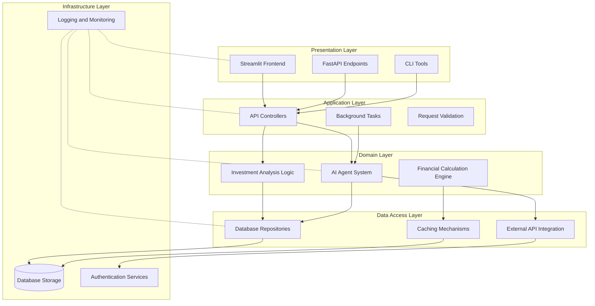
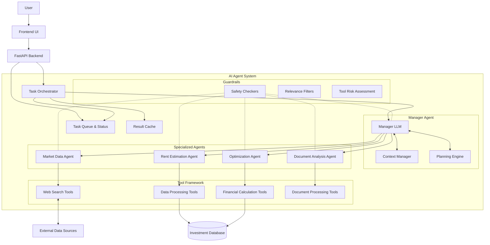
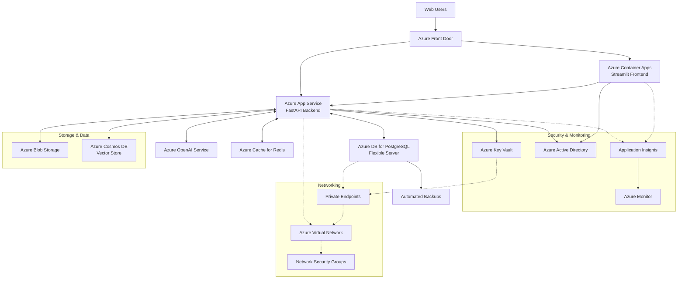

# Property Investment Analysis App with AI Agents

A comprehensive application for real estate investors to analyze potential property investments with the help of AI-powered market data and intelligent analysis.

## Overview

This application helps real estate investors make informed decisions by:

- Collecting real-time market data for target locations
- Estimating potential rental income based on property specifics
- Calculating acquisition costs including closing fees
- Analyzing financing options and mortgage payments
- Projecting detailed cash flow and investment returns
- Assessing tax benefits and regulatory considerations
- Providing AI-powered investment risk and opportunity analysis

The system integrates multiple AI agents to automate complex analytical tasks and deliver accurate, up-to-date information about potential property investments.

## Detailed System Design

### Architecture Overview

The Property Investment Analysis App implements a modern multi-tiered architecture with a clear separation of concerns between different system components:



#### System Layers

1. **Presentation Layer**
   - Streamlit-based web interface
   - RESTful API endpoints for programmatic access
   - CLI tools for administrative operations

2. **Application Layer**
   - API controllers for handling HTTP requests
   - Background task processing for long-running operations
   - Request validation and response formatting

3. **Domain Layer**
   - AI Agent System (core intelligence of the application)
   - Investment analysis business logic
   - Financial calculation engines

4. **Data Access Layer**
   - Database repositories
   - External API integration
   - Caching mechanisms

5. **Infrastructure Layer**
   - Database storage
   - Authentication services
   - Logging and monitoring

### AI Agent System Architecture

The AI agent system is built on the Manager Pattern, providing a scalable approach to complex property investment analysis:



#### Key Components and Interactions

1. **Orchestrator**
   - **Purpose**: Central coordination component that manages tasks and delegates to specialized agents
   - **Implementation**: 
     - Task queue with priority management
     - Asynchronous processing capability
     - Result caching for improved performance
     - Comprehensive status tracking with detailed logging
   - **Communication Patterns**:
     - Receives tasks from API endpoints
     - Delegates to specialized agents
     - Reports results back to API clients

2. **Task Management System**
   - **Task Creation**: Tasks are created with unique IDs and passed to the orchestrator
   - **Status Tracking**: A dedicated tracking system monitors task status through their lifecycle
   - **Error Handling**: Robust error recovery and reporting mechanisms
   - **Results Cache**: Successful results are cached to prevent redundant processing

3. **Specialized Agents**
   - **Market Data Agent**
     - Collects real-time market data for specific locations and property types
     - Implements web search capabilities to find current property prices and trends
     - Includes confidence scoring for data reliability
     - Supports historical data analysis for trend identification
   
   - **Rent Estimation Agent**
     - Analyzes comparable properties to estimate potential rental income
     - Considers property-specific attributes (size, amenities, location)
     - Accounts for local regulations including rent control
     - Provides confidence intervals for estimates
   
   - **Document Analysis Agent**
     - Extracts relevant information from property documents
     - Identifies contractual obligations and restrictions
     - Highlights key terms and conditions
     - Summarizes important insights
   
   - **Optimization Agent**
     - Analyzes current property setup for optimization opportunities
     - Recommends financing adjustments
     - Suggests operational improvements
     - Quantifies potential ROI improvements

4. **Agent Tool Framework**
   - Shared utilities used by multiple agents
   - Web search capabilities with content extraction
   - Data processing and analysis functions
   - Financial calculation tools

### Data Flow Architecture

The system follows a well-defined data flow that ensures efficient processing and information sharing:

```
┌─────────────┐     ┌─────────────┐     ┌─────────────┐     ┌─────────────┐
│             │     │             │     │             │     │             │
│   Client    │────▶│  API Layer  │────▶│ Orchestrator│────▶│ Specialized │
│  Interface  │     │             │     │             │     │   Agents    │
│             │     │             │     │             │     │             │
└──────┬──────┘     └──────┬──────┘     └──────┬──────┘     └──────┬──────┘
       │                   │                   │                   │
       │                   │                   │                   │
       ▼                   ▼                   ▼                   ▼
┌─────────────┐     ┌─────────────┐     ┌─────────────┐     ┌─────────────┐
│             │     │             │     │             │     │             │
│   Response  │◀────│ Task Result │◀────│ Result Cache│◀────│  External   │
│ Formatting  │     │ Processing  │     │             │     │   Sources   │
│             │     │             │     │             │     │             │
└─────────────┘     └─────────────┘     └─────────────┘     └─────────────┘
```

#### Request Flow

1. **Client Request Initiation**:
   - User initiates request through UI or API endpoint
   - Request is validated and normalized

2. **Task Creation and Queueing**:
   - System creates a task with unique identifier
   - Task is added to the orchestrator's queue with appropriate priority
   - Initial status tracking is established

3. **Agent Processing**:
   - Orchestrator delegates task to specialized agent(s)
   - Agents execute their specialized routines
   - Status updates are logged throughout processing

4. **Result Aggregation and Delivery**:
   - Results from agent processing are collected
   - Data is cached for future reference
   - Formatted response is returned to client
   - Status is marked as completed

### Database Schema

The application uses a relational database with the following core tables:

#### Entity-Relationship Diagram

```
┌────────────┐       ┌────────────┐       ┌────────────┐
│            │       │            │       │            │
│    User    │───1:N─┤  Property  │───1:N─┤ RentalUnit │
│            │       │            │       │            │
└────────────┘       └─────┬──────┘       └────────────┘
                           │
                           │
                           │
                     ┌─────┴──────┐       ┌────────────┐
                     │            │       │            │
                     │ Financing  │───1:N─┤  Expense   │
                     │            │       │            │
                     └─────┬──────┘       └────────────┘
                           │
                           │
                           │
                     ┌─────┴──────┐
                     │            │
                     │  Analysis  │
                     │            │
                     └────────────┘
```

#### Key Tables and Relationships

1. **User**
   - Stores user authentication and profile information
   - One user can have multiple properties

2. **Property**
   - Contains core property information (address, purchase price, etc.)
   - Linked to a user
   - One property can have multiple rental units

3. **RentalUnit**
   - Represents individual units within a property
   - Contains unit-specific details (size, layout, current rent)

4. **Financing**
   - Stores financing details for a property
   - Includes loan amount, interest rate, terms

5. **Expense**
   - Records property expenses (taxes, insurance, maintenance)
   - Linked to specific properties

6. **Analysis**
   - Stores the results of investment analyses
   - Includes calculated metrics and AI-generated insights

### Implementation Details

#### Task Status Tracking System

Our recently enhanced task status tracking system provides comprehensive visibility into task processing:

```python
def get_task_status(self, task_id: str) -> str:
    """Get the current status of a task."""
    # First check if we have a result already
    if task_id in self.results_cache:
        status = self.results_cache[task_id].status
        logger.info(f"[Orchestrator] Retrieved status for task {task_id} from results cache: {status}")
        return status
        
    # Then check the task_status dictionary
    if task_id in self.task_status:
        status = self.task_status[task_id]
        logger.info(f"[Orchestrator] Retrieved status for task {task_id} from status tracker: {status}")
        return status
        
    # If not found anywhere, it's unknown
    logger.warning(f"[Orchestrator] No status information found for task {task_id}")
    return "unknown"
```

The status tracking system includes:

1. **Persistent Status Storage**: Task statuses are maintained even after tasks leave the queue
2. **Detailed Status Logging**: Comprehensive logging shows status changes throughout task lifecycle
3. **Status History**: The system maintains the full history of status changes
4. **Graceful Error Handling**: Failed tasks are properly tracked with error details

#### API Rate Limiting and Backoff Strategy

When interacting with external APIs, the system implements sophisticated rate limiting:

1. **Adaptive Backoff**: Exponential backoff with jitter for retries
2. **Request Batching**: Grouping multiple requests to minimize API calls
3. **Cache-First Strategy**: Checking cache before making external requests
4. **Priority Queueing**: Critical requests take precedence in high-load situations

#### Performance Optimizations

To ensure the application remains responsive even under heavy load:

1. **Asynchronous Processing**: Non-blocking I/O operations using Python's asyncio
2. **Result Caching**: Storing frequently accessed data to minimize redundant processing
3. **Query Optimization**: Efficient database queries with appropriate indexing
4. **Resource Pooling**: Connection pooling for database and external API connections
5. **Load Shedding**: Graceful degradation under extreme load conditions

### Deployment Architecture on Azure

For production deployments on Azure, we recommend the following architecture:



The system leverages multiple Azure services for a robust, scalable, and secure deployment:

1. **Compute Services**
   - **Azure App Service** (Premium v3 tier) for the FastAPI backend
   - **Azure Container Apps** for the Streamlit frontend
   - **Azure Functions** for periodic tasks and data updates

2. **Storage & Database**
   - **Azure Database for PostgreSQL Flexible Server** for relational data
   - **Azure Blob Storage** for document storage
   - **Azure Cache for Redis** for caching and session management

3. **AI & Machine Learning**
   - **Azure OpenAI Service** for LLM capabilities
   - **Azure Cognitive Search** for semantic search
   - **Azure Machine Learning** for custom model training and deployment

4. **Security & Identity**
   - **Azure Key Vault** for secret management
   - **Azure Active Directory** for authentication and authorization
   - **Azure Managed Identities** for secure service-to-service communication

5. **Networking & Delivery**
   - **Azure Front Door** for global routing and load balancing
   - **Azure Virtual Network** with private endpoints
   - **Azure DDoS Protection** for network security

#### Azure Service Configuration

For optimal performance and cost-efficiency, we recommend the following service configurations:

1. **App Service**
   - Premium v3 P1v3 (2 vCPU, 8 GiB memory)
   - Auto-scaling: 2-5 instances based on CPU utilization (70% threshold)
   - Deployment slots for blue-green deployments

2. **PostgreSQL Flexible Server**
   - General Purpose tier with 4 vCores
   - 8 GiB RAM, 256 GiB storage
   - Zone redundant high availability
   - 7-day point-in-time restore

3. **Azure OpenAI Service**
   - gpt-4o model deployment with 10 TPM (tokens per minute) quota
   - Standard tier with regional redundancy
   - Private endpoints for secure access

4. **Azure Container Apps**
   - 1.0 vCPU, 2.0 GiB memory allocation
   - Auto-scaling: 0-5 replicas based on HTTP traffic
   - Custom domain with TLS encryption

5. **Azure Cache for Redis**
   - Standard C1 tier (2.5 GB, dedicated service)
   - Data persistence with RDB snapshots every hour
   - 99.9% SLA with geo-replication

#### Azure Cost Optimization

Our Azure deployment includes several cost optimization strategies:

1. **Right-sized Resources**: Matching resource allocation to actual needs
2. **Autoscaling**: Scaling down during low-traffic periods
3. **Reserved Instances**: Using Azure Reserved Instances for predictable workloads
4. **Azure Hybrid Benefit**: Leveraging existing licenses where possible
5. **Resource Sharing**: Sharing resources across non-critical components

## Features

### Property Data Management
- Input detailed property information (address, price, type, age, condition)
- Multi-unit property support with independent unit management
- AI-powered market data collection for the property's location

### Financial Analysis
- Closing cost calculator with regional tax considerations
- Mortgage payment calculator with amortization schedules
- Operating expenses estimation with customizable parameters
- Tax benefit calculator including building depreciation
- Comprehensive cash flow analysis (before and after tax)

### AI-Powered Insights
- Market Data Search Agent: Collects up-to-date market information
- Rent Estimation Agent: Provides accurate rent estimates for vacant units
- Tax Regulation Monitoring: Ensures tax calculations reflect current regulations
- Risk Assessment: Identifies specific investment risks and opportunities
- Optimization Recommendations: Suggests ways to improve investment returns

### Visualization and Reporting
- Interactive dashboard with key metrics
- Visual cash flow breakdowns
- Amortization charts
- Investment metrics visualization
- Downloadable investment reports

## System Architecture

The application follows a modular architecture with several key components:

### User Interface
- Streamlit-based web interface with interactive components
- Responsive design with clear data visualization
- Interactive forms for property data input
- Real-time calculation updates

### Core Application
- API Layer: FastAPI backend service
- Calculation Engine: Complex financial calculations
- Agent Orchestrator: Coordinates multiple AI agents
- Asynchronous task processing for long-running operations

### AI Agents
- Multiple specialized agents for different tasks
- Agent Orchestration Framework for coordination
- Context management for shared information
- LLM integration for natural language processing

### Data Storage
- Property Database: Stores property details
- Market Data Database: Stores collected market information
- Vector Knowledge Base: Stores domain knowledge for agents
- Secure credential management for API access

## Getting Started

### Prerequisites
- Python 3.9+
- uv package manager (recommended) or pip
- Node.js 18+ (for frontend development only)
- pytest-asyncio for running asynchronous tests

### Installation

1. Clone the repository:
```bash
git clone https://github.com/yourusername/investment_agent.git
cd investment_agent
```

2. Install the required packages:

Using uv (recommended):
```bash
# Install uv if you don't have it
# On Linux/macOS
curl -LsSf https://astral.sh/uv/install.sh | sh
# or
wget -qO- https://astral.sh/uv/install.sh | sh

# Or on Windows
powershell -c "irm https://astral.sh/uv/install.ps1 | more"

# Set up a virtual environment and install dependencies with uv
uv venv
source .venv/bin/activate  # On Linux/macOS
# Or on Windows: .venv\Scripts\activate
```
## 2. Install Python packages and dependencies

To install all required packages from a `pyproject.toml` file (such as the one located at the top level of this GitHub repository), run the following command, assuming the file is in the same directory as your terminal session:

```bash
uv sync --dev --python 3.11
```

# OR Install dependencies with uv pip
```bash
uv pip install -e .
# Or with development dependencies
uv pip install -e ".[dev]"
```


### Running the Application

Using uv (recommended):
1. Start the backend API:
```bash
cd investment_agent
source .venv/bin/activate  # If not already activated
uv run -m uvicorn src.backend.api:app --reload
```

2. In a separate terminal, start the frontend:
```bash
cd investment_agent
source .venv/bin/activate  # If not already activated
uv run -m streamlit run src/frontend/app.py
```

Alternative method:
1. Start the backend API:
```bash
cd src
uvicorn backend.api:app --reload
```

2. In a separate terminal, start the frontend:
```bash
cd src
streamlit run frontend/app.py
```

3. Open your browser and navigate to http://localhost:8501

### Troubleshooting Common Issues

- **Backend API connection errors**: Ensure the DATABASE_URL environment variable is correctly set and the database file is accessible.
- **OpenAI API key issues**: Verify your OPENAI_API_KEY is valid and has sufficient credits.
- **Module import errors**: Make sure you've installed the package in development mode with `uv pip install -e .` or `pip install -e .`.
- **Port conflicts**: If ports 8000 or 8501 are already in use, specify alternative ports:
  ```bash
  uv run -m uvicorn src.backend.api:app --reload --port 8080
  uv run -m streamlit run src/frontend/app.py -- --server.port 8081
  ```

## Deployment Options

### Local Deployment
Follow the instructions above for running the application locally.

### Docker Deployment
1. Build the Docker image:
```bash
docker build -t investment-agent .
```

2. Run the container:
```bash
docker run -p 8501:8501 -p 8000:8000 -e DATABASE_URL=sqlite:///./investment_analysis.db -e OPENAI_API_KEY=your_openai_api_key investment-agent
```

### Azure Deployment
The application can be deployed to Azure using the following services:

1. **Azure App Service**: For hosting the FastAPI backend
2. **Azure Container Apps**: For hosting the Streamlit frontend
3. **Azure Database for PostgreSQL Flexible Server**: For the application database
4. **Azure Key Vault**: For secure storage of API keys and secrets
5. **Azure OpenAI Service**: For LLM functionality

#### Azure Deployment Best Practices

- **Infrastructure as Code**: Use Azure Bicep or Terraform to define and deploy your infrastructure
- **CI/CD Pipelines**: Set up GitHub Actions or Azure DevOps Pipelines for automated deployment
- **Zero-Trust Security**: Implement Managed Identities for Azure resources instead of service principals when possible
- **Private Endpoints**: Use private endpoints for Key Vault and Database connectivity
- **VNET Integration**: Place App Service and Container Apps in a virtual network for enhanced security
- **Scalability**: Configure autoscaling rules based on CPU, memory usage, and request count
- **Monitoring**: Set up Azure Monitor and Application Insights for comprehensive observability
- **Backup and Recovery**: Configure automated backups for your PostgreSQL database

Deployment steps:
1. Create the Azure resources using Azure CLI or Azure Portal
2. Configure the application settings with Azure-specific connection strings
3. Deploy the backend and frontend as separate services
4. Set up networking and security rules

See the [Azure Deployment Guide](docs/azure-deployment.md) for detailed instructions.

## Project Structure

```
investment_agent/
├── src/
│   ├── ai_agents/                 # AI agent implementations
│   │   ├── agent_system.py        # Main integration module for AI agents
│   │   ├── guardrails/            # Safety mechanisms for agent behavior
│   │   │   ├── agent_guardrails.py # Implementation of multi-layered guardrails
│   │   ├── orchestrator/          # Agent orchestration framework
│   │   │   ├── orchestrator.py    # Manager Pattern implementation
│   │   │   ├── manager_agent.py   # Manager agent for coordinating specialized agents
│   │   ├── specialized/           # Specialized agent implementations
│   │   │   ├── market_data_agent.py  # Market data collection agent
│   │   │   ├── rent_estimation_agent.py # Rent estimation agent
│   │   │   ├── document_analysis_agent.py # Document processing agent
│   │   │   ├── optimization_agent.py # Investment optimization agent
│   │   ├── tools/                 # Tool implementations for agents
│   │       ├── investment_tools.py # Shared tools for property investment analysis
│   ├── backend/                   # Backend API
│   │   ├── api.py                 # FastAPI implementation
│   ├── database/                  # Database models and connections
│   │   ├── database.py            # Database connection handling
│   │   ├── models.py              # SQLAlchemy models
│   ├── frontend/                  # Frontend application
│   │   ├── app.py                 # Streamlit application
│   └── utils/                     # Utility functions
│       ├── financial_utils.py     # Financial calculation utilities
├── tests/                         # Test suites
│   ├── unit/                      # Unit tests for individual components
│   │   ├── ai_agents/             # Tests for AI agent functionality
│   ├── integration/               # Integration tests
│   └── e2e/                       # End-to-end tests
├── doc/                           # Documentation
│   ├── a-practical-guide-to-building-agents/ # Guide for building AI agents
├── example_usage.py               # Example script demonstrating the AI agent system
├── requirements.txt               # Package dependencies
├── setup.py                       # Package setup
├── pyproject.toml                 # Python project configuration
└── README.md                      # Project documentation
```

### Key Components

#### AI Agent System
- **Agent Orchestrator**: Implements the Manager Pattern to coordinate specialized agents
- **Manager Agent**: Central agent that delegates to specialized agents through tool calls
- **Specialized Agents**: Purpose-built agents for different investment analysis tasks
- **Reusable Tools**: Shared functionality for web search, data analysis, and document processing
- **Guardrails**: Multi-layered safety mechanisms to ensure appropriate agent behavior

#### Backend
- **FastAPI Server**: RESTful API for the application
- **SQLAlchemy Models**: ORM models for database interaction
- **Database Connection**: Handlers for database connections

#### Frontend
- **Streamlit Application**: Interactive web interface
- **Data Visualization**: Components for displaying investment metrics

#### Infrastructure
- **Azure OpenAI Integration**: Support for Azure OpenAI services
- **Database Storage**: Models for storing property and market data
- **Authentication**: User authentication and authorization

## AI Agent Architecture

The application implements a Manager Pattern AI architecture with specialized AI agents for different property investment analysis tasks. The system is designed with the following components:

### Agent Architecture Components

1. **Orchestrator**: Coordinates specialized agents and maintains context across interactions.
   - Manages a task queue
   - Routes tasks to appropriate agents
   - Aggregates results from multiple agents
   - Implements human escalation when needed

2. **Manager Agent**: Central agent that delegates to specialized agents through tool calls.
   - Understands user intents
   - Plans sequences of agent calls
   - Synthesizes results into cohesive responses
   - Manages context between agent interactions

3. **Specialized Agents**:
   - **Market Data Search Agent**: Gathers current market data for target locations.
   - **Rent Estimation Agent**: Estimates rental income based on property characteristics.
   - **Document Analysis Agent**: Extracts key information from property documents.
   - **Optimization Agent**: Suggests ways to optimize investment returns.

4. **Reusable Tools**: Shared functionality that multiple agents can use:
   - Web search tools for gathering market data
   - Database query tools for retrieving property information
   - Document parsing tools for extracting information
   - Analysis tools for financial calculations

5. **Guardrails**: Safety mechanisms that ensure agent behavior stays within defined boundaries:
   - Relevance checkers to ensure on-topic interactions
   - Safety checkers to prevent prompt manipulation
   - PII filters to protect sensitive information
   - Tool risk assessment for high-impact operations

### Using the AI Agent System

The system can be used in two ways:

1. **Using the Manager Agent** (recommended): The manager agent coordinates specialized agents to complete complex tasks.

```python
from src.ai_agents import AIAgentSystem

# Initialize the system
agent_system = AIAgentSystem(model_name="gpt-4o")
agent_system.initialize()

# Process a user request using the manager agent
async def process_request():
    result = await agent_system.process_user_request(
        "I'm considering buying a 2-bedroom apartment in Berlin. Can you analyze..."
    )
    return result
```

2. **Using Specialized Agents Directly**: For specific, focused tasks.

```python
# Execute a task with a specific agent
async def get_market_data():
    market_request = {
        "location": "Berlin Mitte",
        "property_type": "apartment",
        "data_types": ["prices", "rents", "trends"]
    }
    result = await agent_system.execute_direct_task(
        "market_data", 
        json.dumps(market_request)
    )
    return result
```

### Key Benefits

- **Modularity**: Each agent focuses on a specific capability, making the system easier to extend and maintain.
- **Reusable Tools**: Common functionality is implemented once and shared across agents.
- **Comprehensive Guardrails**: Multi-layered protection ensures safe and appropriate agent behavior.
- **Flexible Integration**: Can be used with different LLM providers and models.
- **Context Management**: Maintains information between agent interactions.

See `example_usage.py` for a complete demonstration of the AI agent system.

## Testing the Application

### Unit Tests
Run unit tests with:
```bash
# Install pytest-asyncio first if you haven't
uv pip install pytest-asyncio

# Run all unit tests
python -m pytest tests/unit

# Run specific agent tests
python -m pytest tests/unit/ai_agents

# Run backend API tests
python -m pytest tests/unit/backend
```

Our test suite includes:

1. **Backend API Tests**:
   - Direct tests of API functions using SQLAlchemy models
   - Tests for property, rental unit, and financing endpoints
   - Mock tests for AI-related functionality

2. **AI Agent Tests**:
   - Tests for system initialization with both OpenAI and Azure OpenAI
   - Verification of specialized agent factory functions
   - Integration tests with mocked LLM clients
   - Functional tests for agent behavior

The test architecture follows these principles:
- **Isolation**: Each component is tested independently
- **Mocking**: External dependencies like OpenAI API calls are mocked
- **Async Support**: Tests properly handle asynchronous functions with pytest-asyncio
- **Resilience**: Tests focus on behavior rather than implementation details

### Integration Tests
Run integration tests with:
```bash
python -m pytest tests/integration
```

### End-to-End Tests
Run end-to-end tests with:
```bash
python -m pytest tests/e2e
```

### Test Database
The tests use an in-memory SQLite database to avoid affecting production data:
```python
# Example from our test setup
def setup_test_db():
    """Create test database and return a session factory"""
    # Create the test database and tables
    Base.metadata.create_all(bind=engine)
    
    # Create session factory
    def _get_test_db():
        db = SessionLocal()
        try:
            yield db
        finally:
            db.close()
    
    return _get_test_db
```

### Running Tests in CI/CD
Our tests are designed to run in CI/CD pipelines, with the following recommended workflow:

```yaml
# Example GitHub Actions workflow
name: Run Tests

on: [push, pull_request]

jobs:
  test:
    runs-on: ubuntu-latest
    steps:
      - uses: actions/checkout@v4
      - name: Set up Python
        uses: actions/setup-python@v4
        with:
          python-version: '3.10'
      - name: Install dependencies
        run: |
          python -m pip install --upgrade pip
          pip install uv
          uv pip install -e ".[dev]"
      - name: Run tests
        run: python -m pytest tests/
```

## Development Status

This project is currently in active development with the following components in progress:

- AI Agent System: Core functionality implemented, refinements ongoing
- Backend API: Basic endpoints implemented
- Frontend: Initial Streamlit interface in development
- Database: Schema defined, integration in progress

Next development priorities:
1. Complete and stabilize AI agent implementation
2. Expand API functionality
3. Enhance frontend user experience
4. Implement comprehensive testing

## Contributing

We welcome contributions to the Property Investment Analysis App!

1. Fork the repository
2. Create a feature branch: `git checkout -b feature/your-feature-name`
3. Commit your changes: `git commit -am 'Add some feature'`
4. Push to the branch: `git push origin feature/your-feature-name`
5. Submit a pull request

Please follow these guidelines:
- Use uv for dependency management
- Run tests before submitting a PR
- Follow PEP 8 style guide
- Add appropriate documentation
- Include tests for new features

## License

[MIT License](LICENSE)

## Acknowledgments

- OpenAI for providing advanced language models
- LangChain for the agent framework
- Streamlit for the interactive web interface
- FastAPI for the high-performance backend
- The real estate investment community for domain expertise

## Azure OpenAI Integration

### Overview

The Property Investment Analysis Application can be deployed using Azure OpenAI services for enhanced enterprise features, including:

- Regional data residency compliance with data stored in your selected Azure region
- Azure Active Directory integration for seamless enterprise authentication
- Advanced security and compliance certifications (ISO 27001, SOC 1/2/3, HIPAA)
- Centralized billing and resource management through Azure portal
- Integration with other Azure services like Azure Cognitive Search and Azure Machine Learning
- Private networking capabilities with Virtual Network (VNET) integration

### Azure OpenAI Setup

To use Azure OpenAI with this application:

1. **Create an Azure OpenAI resource**:
   ```bash
   # Install Azure CLI if not already available
   curl -sL https://aka.ms/InstallAzureCLIDeb | sudo bash
   
   # Login to Azure
   az login
   
   # Create a resource group if needed
   az group create --name property-investment-rg --location westeurope
   
   # Create Azure OpenAI resource
   az cognitiveservices account create \
     --name property-investment-openai \
     --resource-group property-investment-rg \
     --kind OpenAI \
     --sku s0 \
     --location westeurope
   ```

2. **Deploy required models**:
   - Deploy `gpt-4o` or `gpt-35-turbo` for the manager agent
   - Deploy smaller models for specialized tasks as needed

3. **Configure environment variables**:
   ```bash
   # For Azure OpenAI
   export AZURE_OPENAI_API_KEY=your_azure_openai_api_key
   export AZURE_OPENAI_ENDPOINT=https://your-resource-name.openai.azure.com/
   export AZURE_OPENAI_DEPLOYMENT_NAME=your_model_deployment_name
   
   # Or use Azure Managed Identity (preferred for production)
   export AZURE_OPENAI_USE_MANAGED_IDENTITY=true
   ```

### Using the Agent System with Azure OpenAI

The AI agent system supports both OpenAI's standard API and Azure OpenAI. Here's how to initialize the agent system with Azure OpenAI:

```python
from src.ai_agents import AIAgentSystem
import os

# Initialize the system with Azure OpenAI
agent_system = AIAgentSystem(
    use_azure=True,
    azure_deployment=os.getenv("AZURE_OPENAI_DEPLOYMENT_NAME"),
    azure_endpoint=os.getenv("AZURE_OPENAI_ENDPOINT")
)
agent_system.initialize()

# Process a user request using the manager agent
async def process_request():
    result = await agent_system.process_user_request(
        "I'm considering buying a 2-bedroom apartment in Berlin. Can you analyze..."
    )
    return result
```

### Azure Architecture for Production Deployment

For production deployments, we recommend:

1. **Azure App Service**: For hosting the FastAPI backend
   - Enable VNET integration
   - Configure autoscaling rules
   - Use deployment slots for zero-downtime deployments

2. **Azure Container Apps**: For hosting the Streamlit frontend
   - Enable scale-to-zero for cost optimization
   - Configure horizontal scaling based on traffic patterns
   - Use GitHub Actions for CI/CD automation

3. **Azure Database for PostgreSQL Flexible Server**: For the application database
   - Enable high availability with zone redundancy
   - Configure automated backups
   - Use Private Link for secure connectivity

4. **Azure Cache for Redis**: For caching search requests and agent context
   - Premium tier for persistence and high availability
   - Configure memory policies based on usage patterns

5. **Azure Key Vault**: For secure storage of API keys and secrets
   - Use Managed Identities for access
   - Enable soft-delete and purge protection
   - Configure access policies with least privilege

6. **Azure OpenAI Service**: For the LLM functionality
   - Deploy models in the same region as your application
   - Configure content filtering settings
   - Set appropriate capacity limits

7. **Azure Monitor & Application Insights**: For monitoring agent performance
   - Set up custom dashboards
   - Configure alerts for key metrics
   - Enable distributed tracing

8. **Azure Front Door**: For global CDN and load balancing
   - Enable WAF protection
   - Configure caching rules
   - Set up health probes for backend services

Here's a deployment architecture diagram:

```
┌─────────────────┐     ┌─────────────────┐     ┌─────────────────┐
│                 │     │                 │     │                 │
│   Web Clients   │────▶│  API Layer     │────▶│  Orchestrator   │
│                 │     │                 │     │                 │
└─────────────────┘     └─────────────────┘     └─────────────────┘
                                                         │
                                                         ▼
                                                ┌─────────────────┐
                                                │                 │
                                                │   Result Cache  │
                                                │                 │
                                                └─────────────────┘
                                                         │
                                                         ▼
                                                ┌─────────────────┐
                                                │                 │
                                                │  External Data  │
                                                │     Sources     │
                                                │                 │
                                                └─────────────────┘
```