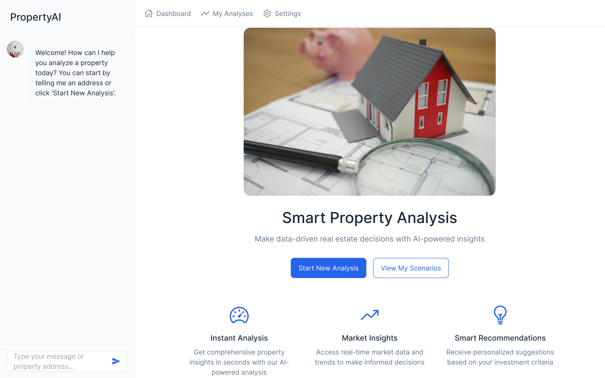
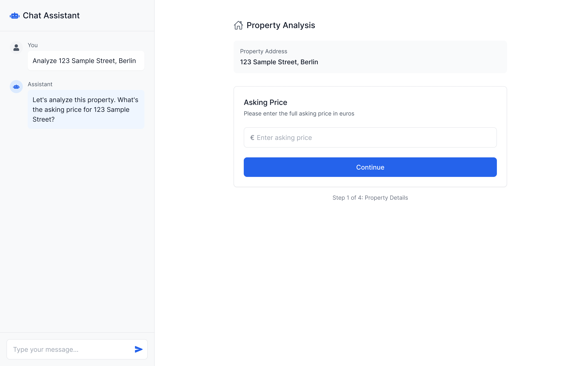
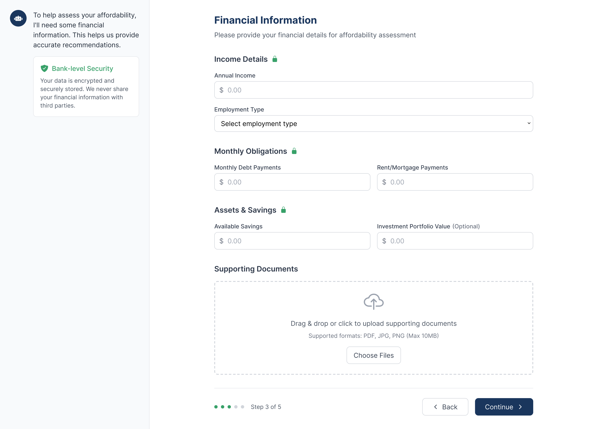
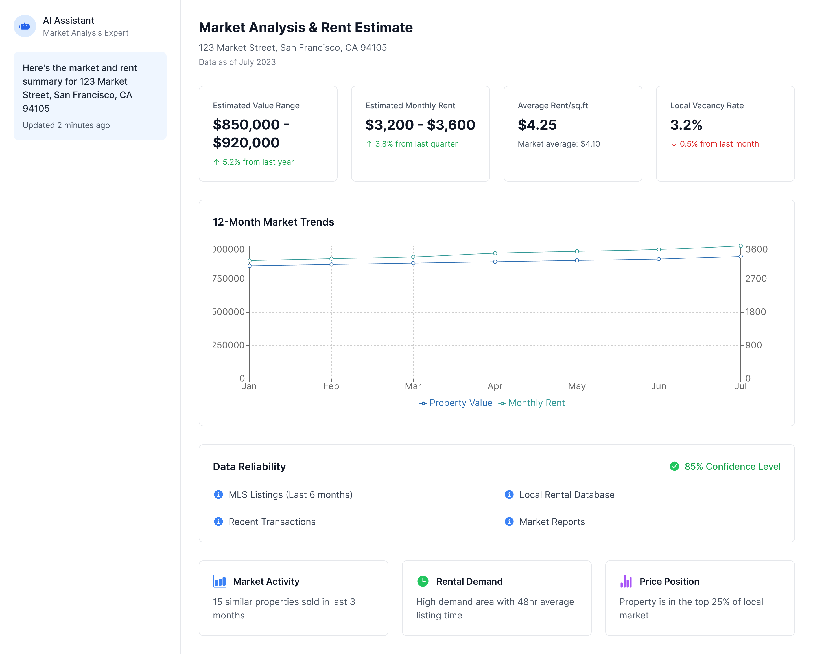
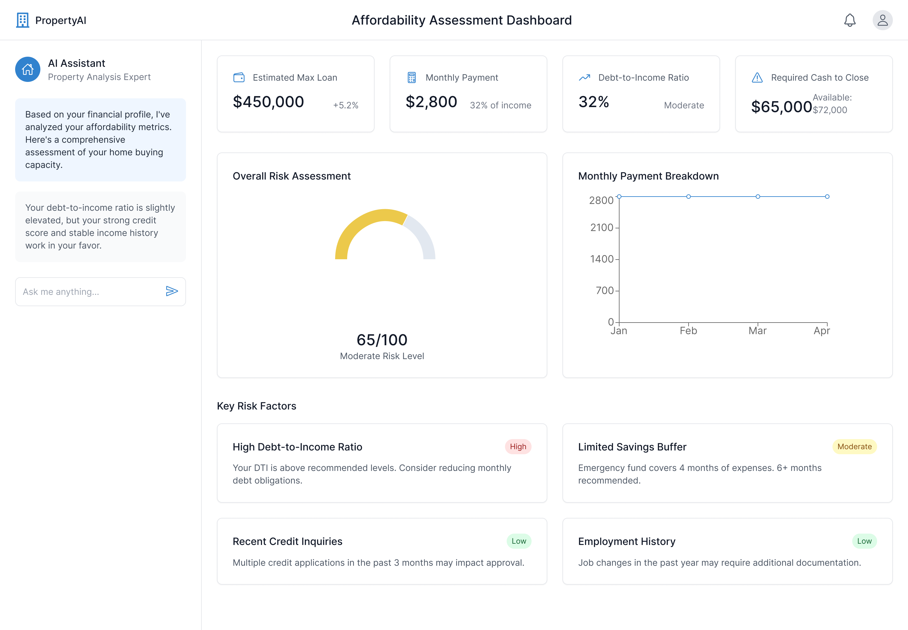
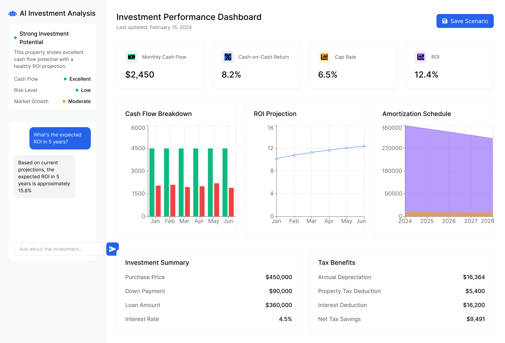
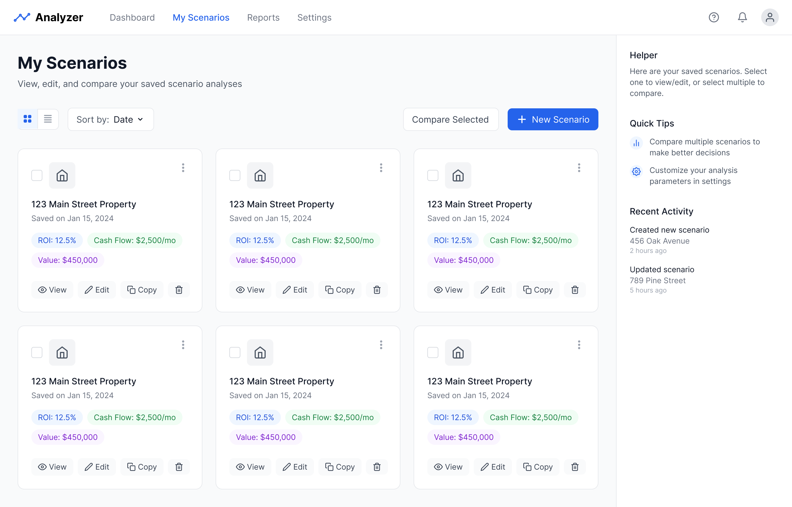
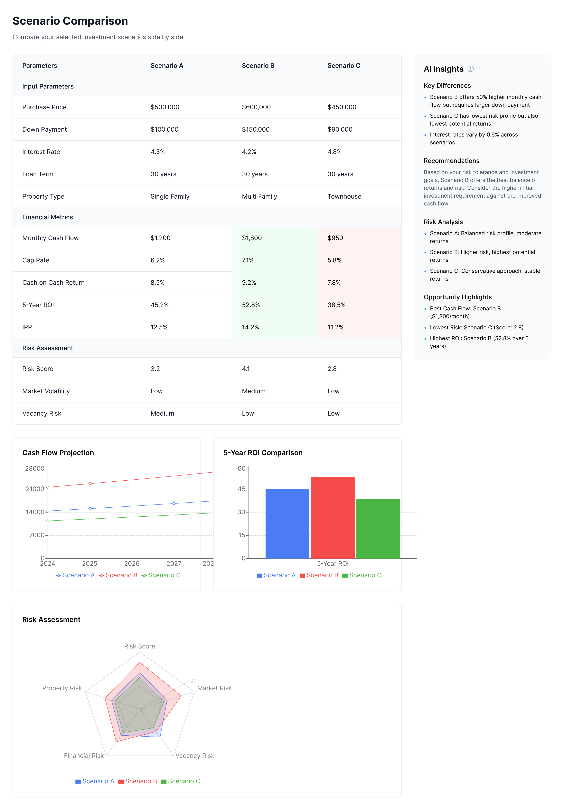

# UI Design Proposal: Conversational Analysis Hub

## Executive Summary
This concept proposes a shift to an integrated, conversational interface combined with dynamic forms and dashboards, designed specifically to guide novice investors through their critical tasks.

## 1. Core Concept

A central workspace where the primary interaction method is conversing with an AI assistant (representing the Manager Agent/Agent Orchestrator) in a persistent chat panel.

The main screen area dynamically displays context-relevant UI elements – focused input forms, editable tables, interactive dashboards, comparison views – directly driven by the conversation flow and the analysis step.

## 2. Layout

- **Persistent Chat Sidebar (Left or Right)**: The main control center. The AI guides the user, asks questions, provides explanations, summarizes findings, and accepts natural language commands or questions. Includes a text input area and send button.

- **Dynamic Main Content Area**: Occupies the majority of the screen. Its content adapts fluidly based on the conversational context (e.g., showing property address input, then user income form, then market analysis dashboard, then scenario comparison view).

- **Minimal Top Navigation**: Links for key sections like "My Scenarios", "Start New Analysis", and User Profile/Settings.

## 3. Interaction Model (Hybrid Approach)

- **Conversational Guidance (Chat)**: The AI proactively guides the user step-by-step through the required analysis tasks. It requests information, clarifies inputs, explains financial concepts using the RAG/Knowledge Base Memory, and summarizes results. Users interact primarily via natural language.

- **Structured Input (Forms/Tables)**: When specific data is needed (e.g., property details, user financials, financing terms), the Main Content Area displays clean, focused, and editable forms or tables. Inputs can be modified directly in the form/table or by instructing the AI in the chat (e.g., "Change the down payment to 25%"). The Memory Management System helps persist and synchronize this data.

- **Results Visualization (Dashboards)**: Key outputs from agents and Calculation Tools (market value, rent estimates, affordability checks, risk scores, ROI projections) are presented in clear, interactive dashboards and summary cards within the Main Content Area.

- **Real-Time Updates**: Leveraging the architecture's SSE channel, dashboards and metrics in the Main Content Area should update instantly as the user modifies inputs via chat or forms, providing immediate feedback.

- **Agent Transparency**: The UI can provide subtle cues when specific backend agents (Market Data, Rent Estimation, Risk Analysis) are invoked (e.g., status messages like "Analyzing market data...", "Assessing affordability...").

## 4. Key User Journeys & Interaction Flow (Mapped to Critical Tasks)

### Journey 1: Property Opportunity Analysis (Critical Task 1)

1. **Initiation**: User: "Analyze property at [Address]".

2. **AI (Chat)**: "Okay, let's look at [Address]. What's the asking price and property type?" → Main Area: Shows price/type input form.

3. (AI guides through essential property details via chat + forms).

4. **AI (Chat)**: "I have the basics. I'll now get the latest market value estimates and potential rental income." (Invokes Market Data & Rent Estimation Agents). → Main Area: Shows processing indicator.

5. **AI (Chat)**: Summarizes findings (e.g., "Estimated market value is €X, potential rent is €Y/month"). → Main Area: Displays Market Data/Rent Estimate dashboard (value range, rent range, confidence scores, key market trends).

### Journey 2: Affordability & Financial Fit Assessment (Critical Task 2)

1. **AI (Chat)**: "To see if this fits your budget, I need some details about your financial situation. Let's start with your annual income." → Main Area: Shows secure income input form.

2. (AI guides through inputting debts, savings. Option to trigger Document Analysis Agent if user uploads pay stubs/statements).

3. **AI (Chat)**: "Thanks. I'm assessing affordability based on your details and current credit conditions..." (Invokes Risk Analysis Agent + Calculation Tools).

4. **AI (Chat)**: Presents findings clearly (e.g., "Based on a typical mortgage, this property appears affordable, but it would push your debt-to-income ratio to Z%. Here are the key risk factors..."). → Main Area: Displays Affordability dashboard (max loan estimate, DTI ratio, risk score breakdown, qualitative risk explanation from Risk Analysis Agent).

### Journey 3: Investment Performance & ROI Calculation (Critical Task 3)

1. **AI (Chat)**: "Now let's figure out the potential return. What financing terms are you considering (down payment %, interest rate)?" → Main Area: Shows financing input form.

2. (AI guides through estimating operating expenses).

3. **AI (Chat)**: "Okay, calculating the full ROI, including estimated tax benefits based on your profile..." (Invokes Calculation Tools, informed by Risk Analysis for tax rate, etc.).

4. **AI (Chat)**: Summarizes key metrics (Cash Flow, CoC Return, Cap Rate, ROI, Tax Savings). → Main Area: Displays interactive Investment Performance dashboard (cash flow charts, ROI breakdown, amortization schedule, tax benefit details). User can tweak inputs (e.g., interest rate) via chat/form and see real-time dashboard updates (via SSE).

### Journey 4: Scenario Comparison (Critical Task 4)

1. **Initiation**: User navigates to "My Scenarios" section or asks "Compare scenario X and scenario Y".

2. **Scenario Management View**: Main Area displays saved scenarios (managed by Scenario Service). User selects scenarios to compare.

3. **Comparison View**: Main Area shows a side-by-side table/dashboard (using Comparison Engine and Diff Visualization). Key inputs and outputs are compared, with differences highlighted.

4. **AI (Chat)**: Provides a natural language summary of the comparison ("Scenario X offers higher cash flow initially, but Scenario Y has a better projected long-term ROI due to lower taxes...").

## 5. Specific UI Components

- **AI Chat Panel**: As described above, with clear messaging, inline actions, processing indicators, and easy input editing.

- **Dynamic Main Content Area**: Displays focused, editable forms/tables; interactive dashboards (using React charting libraries like Recharts, Nivo, or Plotly.js); comparison views.

- **Scenario Management View ("My Scenarios")**: Dedicated page/section with card-based layout for scenarios, clear actions (View, Edit, Duplicate, Delete, Compare), powered by the Scenario Service/Repository.

- **Affordability/Financial Input**: Secure, clearly marked forms within the guided flow, potentially allowing document upload processed by the Document Analysis Agent. Emphasis on data privacy and security.

## 6. Addressing Product Objectives

- **Speed**: Conversational guidance, AI data fetching (Market Data, Rent Estimation), real-time updates (SSE), and flexible input methods accelerate the process.

- **Accuracy**: Centralized backend Calculation Tools, specialized agents (Market Data, Rent Estimation, Risk Analysis), and RAG-enhanced context ensure robust analysis. Clear presentation builds trust.

- **Risk Assessment**: Dedicated Affordability & Financial Fit Assessment journey leverages the Risk Analysis Agent for tailored, understandable risk evaluations presented clearly in dashboards and chat.

- **Education**: The AI Assistant (Manager Agent) proactively explains terms, metrics, risks, and considerations contextually throughout the flow, drawing from the Knowledge Base Memory. Interactive elements (tooltips, info icons) supplement this.

## 7. Technology Recommendation

- **Frontend Framework**: React is strongly recommended to build the required dynamic, interactive, and stateful UI, aligning with the architecture's mention of React for client-side updates.

- **Styling/UI Components**: Utilize Tailwind CSS for efficient styling. Component libraries like Shadcn/ui (built on Tailwind) or Headless UI offer accessible, modern building blocks suitable for the clean, trustworthy aesthetic.

- **State Management**: A robust library like Zustand or Redux Toolkit is essential for managing complex application state (chat, form inputs, analysis results, scenario data, UI state).

- **Backend Communication**: Use asynchronous requests (fetch/axios) for API calls. Implement Server-Sent Events (SSE) as specified in the architecture to enable real-time dashboard updates based on input changes or background agent progress.

- **Responsive Design**: Implement a fluid grid system with CSS Grid and Flexbox to ensure the UI adapts properly to different screen sizes. Define appropriate breakpoints (small, medium, large screens) with specific layout adjustments for each. Use relative units (rem, %, vh/vw) rather than fixed pixels to allow content to scale appropriately.

## 8. Wireframe Descriptions

This section describes the key screens/states envisioned for the wireframing phase, illustrating the hybrid interaction model.

### Wireframe 1: Initial State / Welcome Screen

- **Layout**: Persistent Chat Sidebar on one side, Main Content Area occupies the rest. Minimal Top Navigation visible.

- **Chat Sidebar**: Shows a welcome message from the AI Assistant (e.g., "Welcome! How can I help you analyze a property today? You can start by telling me an address or click 'Start New Analysis'."). Includes the chat input field.

- **Main Content Area**: Displays a welcoming graphic or introductory text. Includes prominent buttons/links like "Start New Analysis" and potentially "View My Scenarios".

- **Responsive Behavior**: On smaller screens, the chat sidebar should collapse to a button that can expand when needed. The main content area should adjust proportionally to fill available space with no gaps between components. Content should be center-aligned with appropriate padding to prevent edge-touching on large screens.

- **Purpose**: Onboard the user and provide clear starting points.

### Wireframe 2: Guided Input - Property Details

- **Context**: User has initiated an analysis (e.g., typed "Analyze [Address]").

- **Chat Sidebar**: Shows the user's message and the AI's response requesting specific info (e.g., "Okay, let's look at [Address]. What's the asking price?").

- **Main Content Area**: Displays a clean, simple form containing only the input field(s) requested by the AI (e.g., a single field for "Asking Price (€)"). Previously entered data (like the address) might be displayed read-only for context.

- **Responsive Behavior**: Form elements should resize proportionally and stack vertically on smaller screens. Input fields should maintain minimum touch-friendly dimensions (at least 44px height) regardless of screen size.

- **Purpose**: Demonstrate the focused, step-by-step data entry guided by the chat.

### Wireframe 3: Guided Input - User Financials (Affordability)

- **Context**: AI has requested user's financial details.

- **Chat Sidebar**: Shows the AI's request (e.g., "To check affordability, please provide your approximate annual income."). May include reassurances about data privacy.

- **Main Content Area**: Displays a secure-looking form section for financial input (e.g., fields for "Annual Income", "Monthly Debts", "Available Savings"). May include an option/button for document upload ("Upload Pay Stub/Statement"). Input fields are clearly labeled.

- **Responsive Behavior**: Financial forms should maintain structural integrity across screen sizes, with appropriate field widths and clear labeling. On smaller screens, fields stack vertically with full width.

- **Purpose**: Illustrate how sensitive data is collected within the guided flow.

### Wireframe 4: Dashboard View - Market Data / Rent Estimate

- **Context**: AI has fetched market/rent data after user provided property details.

- **Chat Sidebar**: Shows AI's summary message (e.g., "Here's the market and rent summary for [Address]...").

- **Main Content Area**: Displays a dashboard view with:
  - Key metric cards (e.g., "Estimated Value Range", "Estimated Rent Range", "Avg. Rent/sqm", "Vacancy Rate")
  - Maybe a simple chart showing value/rent trends if available
  - Confidence scores or data source information
  - Clear headings indicating this is the Market/Rent analysis

- **Responsive Behavior**: Dashboard metrics should reorganize from a grid to a vertical stack on smaller screens. Charts should be responsive with appropriate minimum heights and resize proportionally to container width.

- **Purpose**: Show how analysis results are presented visually in the main area, complementing the chat summary.

### Wireframe 5: Dashboard View - Affordability Assessment

- **Context**: AI has analyzed user financials against property cost/financing.

- **Chat Sidebar**: Shows AI's summary and explanation of affordability/risks.

- **Main Content Area**: Displays an "Affordability & Risk" dashboard with:
  - Key metric cards (e.g., "Estimated Max Loan", "Debt-to-Income Ratio", "Required Cash to Close")
  - A visual risk indicator or score (e.g., gauge chart, color-coded score)
  - A section listing key risk factors identified by the Risk Analysis Agent (e.g., "High DTI", "Low Savings Buffer")

- **Responsive Behavior**: Risk indicators and metrics should maintain visibility and readability across screen sizes. Charts should resize proportionally with minimum dimensions to ensure readability.

- **Purpose**: Demonstrate the presentation of the crucial affordability and risk assessment.

### Wireframe 6: Dashboard View - Investment Performance / ROI

- **Context**: Full analysis is complete.

- **Chat Sidebar**: Shows AI's summary of the overall investment potential (Cash Flow, ROI, etc.).

- **Main Content Area**: Displays the main analysis dashboard with interactive elements:
  - Key metric cards (Monthly Cash Flow, CoC Return, Cap Rate, ROI)
  - Interactive charts (Cash Flow breakdown, ROI projection over time, Amortization schedule). Users can hover for details
  - Breakdown of tax benefits
  - Summary of key inputs (Purchase Price, Loan Amount, Interest Rate) - potentially editable directly here or via chat, triggering real-time chart updates (SSE)
  - A "Save Scenario" button

- **Responsive Behavior**: Complex dashboards should use progressive disclosure on smaller screens, with the ability to expand sections for details. Charts should resize fluidly while maintaining aspect ratios appropriate for the data being visualized.

- **Purpose**: Show the comprehensive, interactive results dashboard with real-time update capability.

### Wireframe 7: Scenario Management View

- **Context**: User navigated via Top Nav ("My Scenarios").

- **Chat Sidebar**: May show a relevant message like "Here are your saved scenarios. Select one to view/edit, or select multiple to compare."

- **Main Content Area**: Displays a grid or list of saved scenarios using cards. Each card shows key info (Address/Name, Date Saved, key metric like ROI or Cash Flow). Includes controls for selection (checkboxes), and actions per card (View, Edit, Duplicate, Delete). A prominent "Compare Selected" button appears when multiple scenarios are selected.

- **Responsive Behavior**: Scenario cards should adjust from multi-column to single-column layouts on smaller screens. Card content should remain proportional and readable without horizontal scrolling.

- **Purpose**: Illustrate the interface for managing saved analyses.

### Wireframe 8: Scenario Comparison View

- **Context**: User selected two or more scenarios to compare.

- **Chat Sidebar**: Shows AI's summary of the key differences.

- **Main Content Area**: Displays a side-by-side comparison view:
  - Columns representing each selected scenario
  - Rows for key inputs (Price, Down Payment, Interest Rate, etc.) and key outputs (Cash Flow, ROI, Cap Rate, Risk Score, etc.)
  - Differences between values are visually highlighted (e.g., color coding, delta values)
  - Potentially includes comparative charts overlaying key metrics

- **Responsive Behavior**: Comparison tables should transform to a more vertical orientation on smaller screens, potentially showing one scenario at a time with swipe/tab navigation between scenarios.

- **Purpose**: Show how multiple scenarios are presented for easy comparison.

## 9. Implementation Guidelines for Responsive Design

### General Principles
- **Fluid Layout**: Use CSS Grid and Flexbox for main layout structures to ensure elements resize proportionally.
- **Breakpoints**: Implement at least three breakpoints (mobile: <768px, tablet: 768-1024px, desktop: >1024px).
- **Component Flexibility**: All UI components should adapt to their container width rather than fixed dimensions.
- **No Fixed Heights**: Avoid fixed height declarations that could cause overflow issues when content expands.
- **Touch-Friendly**: Ensure all interactive elements have a minimum touch target size of 44×44px.

### Specific Solutions
- **Welcome Page Gap Fix**: Use `grid-template-rows: auto 1fr auto` with proper `min-height: 100vh` on the container to ensure the page fills the entire viewport with no gaps.
- **Chat Sidebar**: Implement as a fixed-width element on large screens (e.g., 320px) that transforms to a drawer pattern on mobile that can be toggled.
- **Dynamic Content Resizing**: Ensure all charts and visualizations use percentage-based dimensions with appropriate aspect ratios and min/max constraints.
- **Overflow Handling**: Apply `overflow-x: auto` selectively only where horizontal scrolling is absolutely necessary.
- **Text Scaling**: Use relative units (rem) for typography to respect user browser settings.

### Testing Requirements
- Test on multiple device sizes and orientations
- Verify that no horizontal scrollbars appear unexpectedly
- Ensure all interactive elements remain accessible at all screen sizes
- Check that text remains readable and doesn't overflow containers
- Verify that charts and visualizations maintain their utility at smaller sizes

This enhanced responsive design approach should resolve both the welcome page gap issues and ensure proper resizing behavior across all pages of the application.