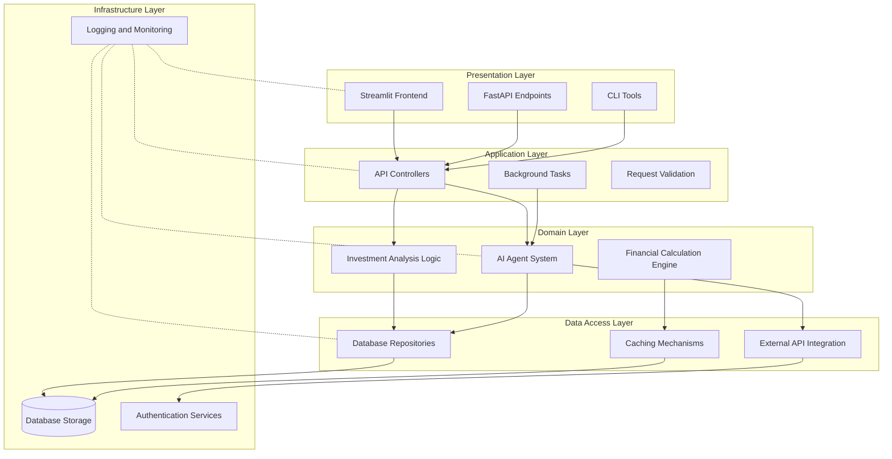
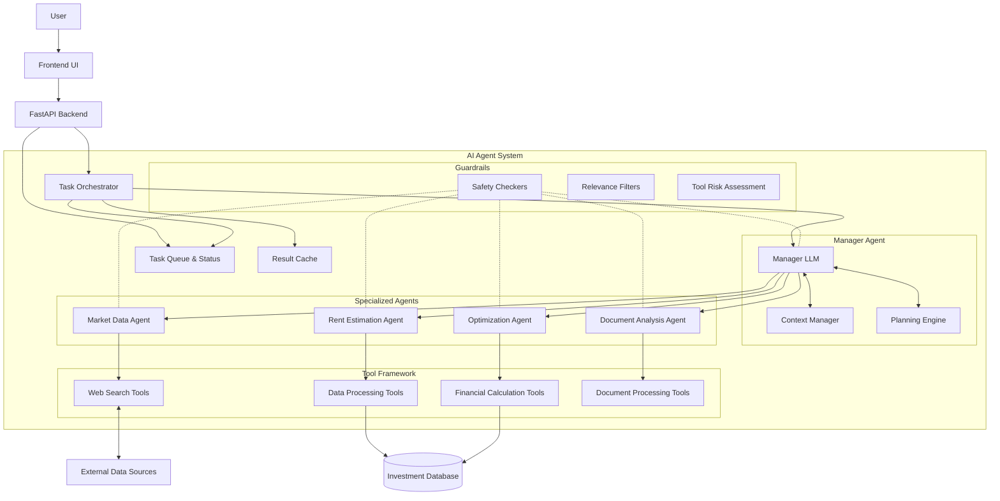
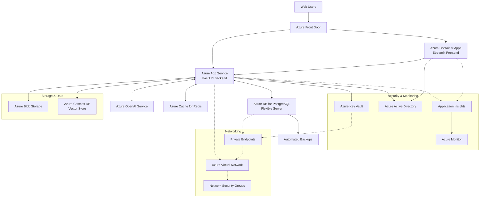

# System Architecture Diagram

This document contains the system architecture diagrams for the Property Investment Analysis App using Mermaid syntax.

## System Architecture

## AI Agent Architecture

## Azure Deployment Architecture

