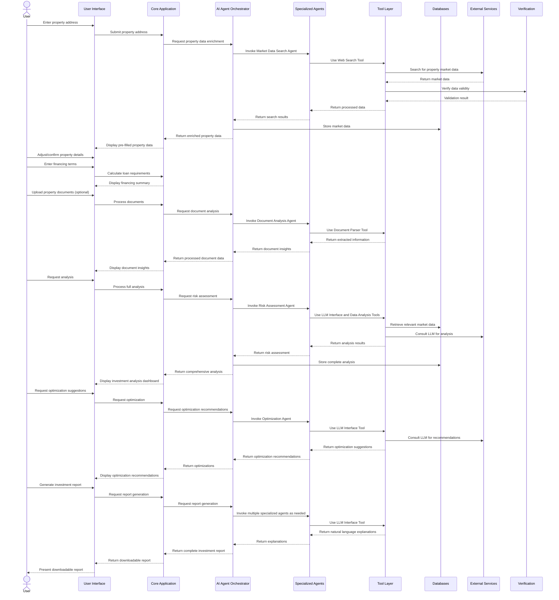
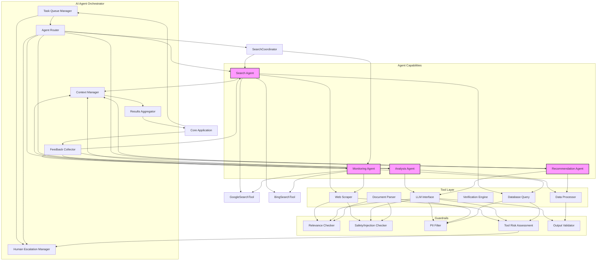
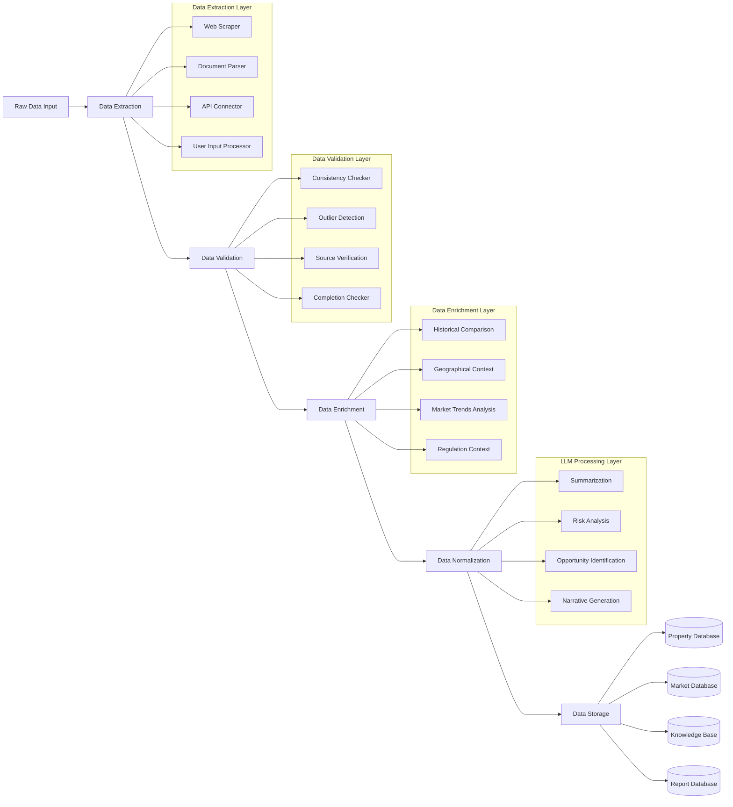
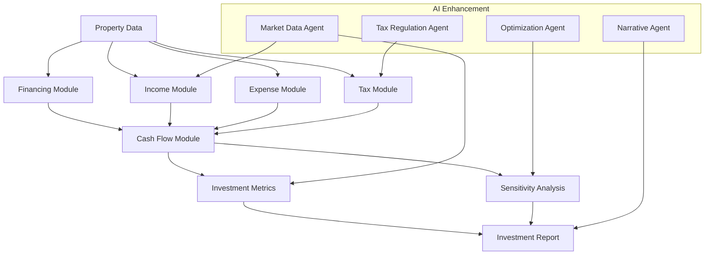
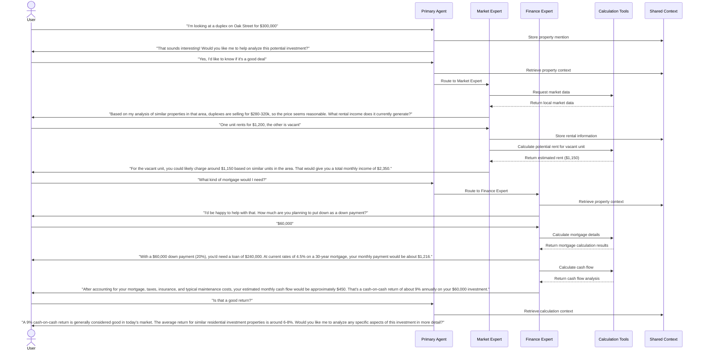

# Property Investment Analysis Application
## Project Requirements Document

**Version:** 1.1  
**Date:** April 25, 2025  
**Author:** Ali Bina

---

## Executive Summary

This document outlines the comprehensive requirements for a Property Investment Analysis Application with integrated AI capabilities. The application aims to automate and enhance the process of evaluating property investments by providing accurate financial projections, real-time market data, and intelligent analysis. The system leverages an AI Agent Orchestration framework with specialized agent tools to collect market information, analyze investment potential, monitor regulatory changes, and generate insights in natural language.

---

## 1. Project Overview

### 1.1 Purpose

The Property Investment Analysis Application will serve as a comprehensive tool for real estate investors to evaluate potential property investments. The application will automate complex calculations, retrieve current market data, and provide intelligent analysis to support informed investment decisions.

### 1.2 Scope

The application will include:
- Property data management
- Financial calculation engine
- AI-powered market data collection
- Intelligent investment analysis
- Document processing capabilities
- Reporting and visualization tools
- User account management

### 1.3 Target Users

- Individual property investors
- Professional real estate investors
- Investment advisors
- Property portfolio managers
- Real estate investment firms

---

## 2. System Architecture Overview

```mermaid
flowchart TD
    subgraph "User Interface"
        UI[Web/Mobile Interface]
        Dashboard[Interactive Dashboard]
        Reports[Report Generation]
    end

    subgraph "Core Application"
        API[API Layer]
        Auth[Authentication]
        Calc[Calculation Engine]
        Orchestrator[AI Agent Orchestrator]
    end

    subgraph "AI Agents"
        SearchAgent[Market Data Search Agent]
        RentAgent[Rent Estimation Agent]
        TaxAgent[Tax Regulation Agent]
        RiskAgent[Risk Assessment Agent]
        DocAgent[Document Analysis Agent]
        OptAgent[Optimization Agent]
    end

    subgraph "Tools Layer"
        GoogleSearchTool[Google Search Tool]
        BingSearchTool[Bing Search Tool]
        WebScraper[Web Scraper Tool]
        DocParser[Document Parser Tool]
        DataAnalysis[Data Analysis Tool]
        LLMInterface[LLM Interface Tool]
        DBQuery[Database Query Tool]
        Verification[Data Verification Tool]
    end

    subgraph "Data Storage"
        UserDB[(User Database)]
        PropertyDB[(Property Database)]
        MarketDB[(Market Data Database)]
        VectorDB[(Vector Knowledge Base)]
    end

    subgraph "External Services"
        GoogleSearch[Google Search API]
        BingSearch[Bing Search API]
        RealEstate[Real Estate Websites]
        GovData[Government Databases]
        TaxRegs[Tax Regulation Sources]
        MortgageAPI[Mortgage Rate APIs]
        LLM[LLM Providers]
    end

    UI --> API
    Dashboard --> API
    Reports --> API
    
    API --> Auth
    API --> Calc
    API --> Orchestrator
    
    Orchestrator --> SearchAgent
    Orchestrator --> RentAgent
    Orchestrator --> TaxAgent
    Orchestrator --> RiskAgent
    Orchestrator --> DocAgent
    Orchestrator --> OptAgent
    
    SearchAgent --> GoogleSearchTool
    SearchAgent --> BingSearchTool
    SearchAgent --> WebScraper
    RentAgent --> LLMInterface
    TaxAgent --> GoogleSearchTool
    TaxAgent --> BingSearchTool
    TaxAgent --> WebScraper
    RiskAgent --> LLMInterface
    DocAgent --> DocParser
    OptAgent --> LLMInterface
    
    GoogleSearchTool --> GoogleSearch
    BingSearchTool --> BingSearch
    WebScraper --> RealEstate
    WebScraper --> GovData
    WebScraper --> TaxRegs
    LLMInterface --> LLM
    DBQuery --> UserDB
    DBQuery --> PropertyDB
    DBQuery --> MarketDB
    DBQuery --> VectorDB
    
    SearchAgent --> DBQuery
    RentAgent --> DBQuery
    TaxAgent --> DBQuery
    RiskAgent --> DBQuery
    DocAgent --> DBQuery
    OptAgent --> DBQuery
    
    DocParser --> Verification
    WebSearch --> Verification
    LLMInterface --> Verification
    
    Calc --> UserDB
    Calc --> PropertyDB
    Calc --> MarketDB
    
    UserDB --> API
    PropertyDB --> API
    MarketDB --> API
```

---

## 3. User Workflow

---

## 4. AI Agent Orchestration

---

## 5. Data Processing Pipeline

---

## 6. Calculation Engine Flow

---

## 7. Detailed Requirements

### 7.1 Core Application Requirements

| **Requirement ID** | **Description** | **User Story** | **Expected Behavior/Outcome** |
|-------------------|-----------------|----------------|------------------------------|
| **FR-001** | Property Data Input | As a property investor, I want to enter basic property details so that I can analyze its investment potential. | The system should provide input fields for property address, purchase price, property type, year built, size in square meters, number of units, and condition assessment. Data validation ensures numbers are within reasonable ranges. |
| **FR-002** | Purchase Cost Calculator | As an investor, I want to calculate total acquisition costs including closing fees so I understand the full initial investment. | When a user enters the purchase price, the system automatically calculates estimated closing costs (notary, tax, agent fees) based on regional standards. User can override with actual figures. Total acquisition cost updates automatically. |
| **FR-003** | Financing Details | As an investor, I want to input my financing structure so I can understand my loan requirements. | User can enter available cash, desired down payment, and receive calculations for loan amount needed. System should validate that down payment meets minimum requirements (e.g., covers closing costs plus bank's minimum percentage). |
| **FR-004** | Mortgage Payment Calculator | As an investor, I want to calculate my monthly mortgage payments based on various financing terms. | System calculates monthly payments using input loan amount, interest rate, repayment rate (Tilgung), and term. Calculations should show amortization schedule with interest-principal breakdown for each year. |
| **FR-005** | Multi-Unit Rental Structure | As an investor buying a multi-unit building, I want to input details for each unit independently. | System allows adding information for multiple units (occupied/vacant status, size, current rent, potential rent, lease terms). Each unit should be stored separately with its own attributes. |
| **FR-006** | Rental Income Projections | As an investor, I want to estimate potential rental income for vacant units based on local market data. | System should calculate potential rent based on unit size, features, and location using either manual input or integration with rent index data (Mietspiegel). Should flag if estimated rent exceeds legal limits (Mietpreisbremse). |
| **FR-007** | Operating Expenses Calculation | As an investor, I want to estimate all recurring expenses to determine net operating income. | System calculates all regular expenses including property tax, insurance, non-recoverable maintenance costs, property management, and a reserve fund. Expenses should be calculated both as fixed amounts and as percentages of gross income for sensitivity analysis. |
| **FR-008** | Tax Benefit Calculator | As an investor, I want to estimate my tax benefits from property depreciation and expenses. | System calculates depreciation (AfA) based on building value (excluding land value), mortgage interest deductions, and other qualifying expenses. Tax benefit is calculated using user's marginal tax rate to show annual and monthly tax savings. |
| **FR-009** | Cash Flow Analysis | As an investor, I want to see detailed monthly and annual cash flow projections. | System generates comprehensive cash flow statement showing all income sources and expenses, with monthly and annual views. Cash flow before and after tax benefits should be clearly displayed. |
| **FR-010** | Personal Affordability Assessment | As an investor, I want to evaluate if I can personally afford this investment given my other financial obligations. | User can input personal income, existing debt obligations, and living expenses. System compares total income to total expenses including the new investment to provide affordability assessment with safety margin calculations. |

### 7.2 AI Agent Requirements

| **Requirement ID** | **Description** | **User Story** | **Detailed Requirements** |
|-------------------|-----------------|----------------|---------------------------|
| **AI-001** | Market Data Search Capability | As an investor, I want the system to automatically gather up-to-date market data for my target location. | **Specialized Agent Tool:**  - Implements SearchAgent capability that utilizes Google Search, Bing Search, Web Scraper, and DatabaseQuery tools  - Tasks: Collect current rental rates, property values, vacancy rates, and market trends   **Reusable Tools:**  - `google_search(query, params)`: Performs structured search via Google Search API  - `bing_search(query, params)`: Performs structured search via Bing Search API  - `web_scrape(url, selectors)`: Targeted scraping from specific websites when needed  - `parse_market_data(raw_data)`: Extracts structured data from search results and web pages  - `store_market_data(parsed_data)`: Saves to MarketDB with source attribution   **Instructions:**  1. Accept location and data type parameters  2. Formulate search queries based on data requirements  3. Execute tiered search strategy:     a. First attempt Google Search API with structured query     b. If insufficient results, try Bing Search API with refined query     c. For specific data needs or if search APIs yield insufficient results, use targeted web scraping  4. Parse and validate results with confidence scores  5. Compare data across sources to identify discrepancies  6. Store validated data with timestamps and source citations   **Model Selection:** Smaller, faster models sufficient for search and extraction   **Guardrails:**  - Relevance check ensures searches stay on topic  - Data validation confirms values within reasonable ranges  - Source verification prioritizes reliable websites   **Human Intervention:**  - Trigger when confidence scores below threshold  - Trigger when conflicting data found across sources |
| **AI-002** | Rent Estimation Capability | As an investor, I want accurate rent estimates for vacant units based on current market conditions. | **Specialized Agent Tool:**  - Implements AnalysisAgent capability using LLMInterface and DataProcessor tools  - Tasks: Generate rental estimates based on property specifics and market data   **Reusable Tools:**  - `query_market_data(location, property_type)`: Retrieves comparable properties  - `analyze_comparables(property_data, comparables)`: Determines relevant factors  - `generate_rent_estimate(property, analysis)`: Produces estimate with reasoning   **Instructions:**  1. Retrieve property specifics (size, features, condition)  2. Query database for comparable properties in location  3. Analyze key factors affecting rent (renovations, amenities, etc.)  4. Generate estimate with low/medium/high ranges  5. Check against Mietpreisbremse limits and flag if exceeded   **Model Selection:** More capable model for analysis and reasoning   **Guardrails:**  - Output validation ensures estimates within realistic ranges  - Flag potential legal issues (rent control violations)   **Human Intervention:**  - Trigger when limited comparable data available  - Trigger for unusual property features requiring judgment |
| **AI-003** | Tax Regulation Monitoring Capability | As an investor, I want to ensure my tax calculations reflect current regulations. | **Specialized Agent Tool:**  - Implements MonitoringAgent capability using WebSearch and DatabaseQuery tools  - Tasks: Track changes to tax regulations affecting property investments   **Reusable Tools:**  - `monitor_tax_sources(region)`: Regularly checks official sources  - `detect_regulation_changes(old_data, new_data)`: Identifies changes  - `update_tax_rules(changes)`: Updates calculation parameters   **Instructions:**  1. Periodically scan official tax regulation sources  2. Compare with previously stored regulations  3. Extract and categorize changes (depreciation rates, deductible expenses)  4. Update system rules and affected calculations  5. Generate notification for users with affected properties   **Model Selection:** Balanced model for reliable text analysis   **Guardrails:**  - Source verification ensures only official sources used  - Change validation requires confidence threshold   **Human Intervention:**  - Trigger for major regulatory changes  - Required approval before updating core tax calculation rules |
| **AI-004** | Property Description Analysis Capability | As an investor, I want to extract relevant investment parameters from property listings or descriptions. | **Specialized Agent Tool:**  - Implements AnalysisAgent capability using DocumentParser and LLMInterface tools  - Tasks: Extract structured data from unstructured property descriptions   **Reusable Tools:**  - `parse_property_text(description)`: Extracts key parameters  - `validate_extracted_data(data)`: Checks completeness and consistency  - `identify_missing_information(data)`: Determines critical gaps   **Instructions:**  1. Process raw property description text  2. Extract key parameters (size, units, condition, rents)  3. Validate extracted data for consistency and plausibility  4. Identify missing critical information  5. Populate appropriate system fields  6. Generate prompts for user to provide missing data   **Model Selection:** Smaller, faster model sufficient for standard extraction   **Guardrails:**  - PII filter removes sensitive information  - Data validation flags implausible values   **Human Intervention:**  - Trigger when critical data missing  - Trigger for ambiguous descriptions requiring interpretation |
| **AI-005** | Investment Risk Assessment Capability | As an investor, I want an AI-powered assessment of investment risks and opportunities. | **Specialized Agent Tool:**  - Implements AnalysisAgent capability using LLMInterface and DataProcessor tools  - Tasks: Analyze property profile and identify specific risks and opportunities   **Reusable Tools:**  - `analyze_market_position(property, market_data)`: Compares to market  - `identify_risk_factors(property, analysis)`: Finds potential issues  - `calculate_risk_metrics(factors)`: Quantifies risks with confidence levels   **Instructions:**  1. Analyze complete property profile and location data  2. Identify specific risks (vacancy, regulation changes, interest rate sensitivity)  3. Assess opportunities (appreciation potential, rental growth)  4. Assign confidence levels to each factor  5. Generate qualitative and quantitative risk assessment  6. Provide specific reasoning for highest impact factors   **Model Selection:** Most capable model for complex reasoning   **Guardrails:**  - Tool safeguards due to high-impact output  - Output validation ensures comprehensive coverage   **Human Intervention:**  - Trigger for unusual risk profiles  - Required for final review of high-risk assessments |
| **AI-006** | Market Trend Analysis Capability | As an investor, I want insights on neighborhood and market trends that might affect my investment. | **Specialized Agent Tool:**  - Implements AnalysisAgent capability using WebSearch and DataProcessor tools  - Tasks: Process historical data and news to identify neighborhood trends   **Reusable Tools:**  - `gather_historical_data(location, timeframe)`: Collects price/rent history  - `search_development_news(location)`: Finds upcoming projects  - `analyze_demographic_shifts(location_data)`: Identifies population trends   **Instructions:**  1. Gather historical property values and rental rates  2. Search for local development projects and news  3. Analyze demographic data and migration patterns  4. Identify gentrification indicators or neighborhood changes  5. Present findings with sources and reasoning  6. Explain potential impact on property values and rental rates   **Model Selection:** Capable model for correlation and trend analysis   **Guardrails:**  - Source verification for news and development claims  - Relevance check for neighborhood boundary definition   **Human Intervention:**  - Trigger for contradictory trend indicators  - Trigger when limited historical data available |
| **AI-007** | Mortgage Rate Monitoring Capability | As an investor, I want to be alerted about favorable financing opportunities. | **Specialized Agent Tool:**  - Implements MonitoringAgent capability using WebSearch and DBQuery tools  - Tasks: Monitor current mortgage rates and special financing programs   **Reusable Tools:**  - `track_mortgage_rates(lenders)`: Monitors multiple sources  - `compare_rates(current_rates, historical_rates)`: Identifies significant changes  - `match_financing_programs(investor_profile)`: Finds suitable options   **Instructions:**  1. Regularly monitor rates from multiple lenders  2. Compare to historical averages and user's current terms  3. Identify specialized financing programs (green building, first-time buyer)  4. Match investor profiles to available opportunities  5. Generate alerts for significant decreases or matching programs  6. Provide direct comparisons to current financing   **Model Selection:** Smaller, faster model sufficient for comparison   **Guardrails:**  - Data validation confirms rates within realistic ranges  - Source verification ensures legitimate lenders   **Human Intervention:**  - No critical intervention points; automated monitoring |
| **AI-008** | Optimization Recommendation Capability | As an investor, I want AI-powered suggestions to optimize my investment returns. | **Specialized Agent Tool:**  - Implements RecommendationAgent capability using LLMInterface and DataProcessor tools  - Tasks: Analyze investment and suggest specific optimizations   **Reusable Tools:**  - `analyze_investment_efficiency(property_data)`: Identifies suboptimal aspects  - `simulate_optimizations(property, potential_changes)`: Models outcomes  - `prioritize_recommendations(simulations)`: Ranks by ROI impact   **Instructions:**  1. Analyze complete property and financial data  2. Identify potentially suboptimal aspects (financing, rent, expenses)  3. Generate possible optimization strategies  4. Simulate impact of each strategy on ROI and cash flow  5. Prioritize recommendations by implementation cost and benefit  6. Provide specific implementation steps with timeframes   **Model Selection:** Most capable model for complex reasoning   **Guardrails:**  - Tool safeguards due to high-impact recommendations  - Output validation ensures recommendations are actionable   **Human Intervention:**  - Required for approval of major optimization suggestions  - Trigger for strategies requiring significant capital investment |
| **AI-009** | Document Analysis Capability | As an investor, I want to extract relevant information from property documents like leases and inspection reports. | **Specialized Agent Tool:**  - Implements AnalysisAgent capability using DocumentParser and LLMInterface tools  - Tasks: Extract key information from uploaded property documents   **Reusable Tools:**  - `extract_document_text(file)`: Converts document to text  - `classify_document_type(text)`: Determines document category  - `extract_key_information(text, doc_type)`: Pulls relevant data   **Instructions:**  1. Process uploaded document and convert to text  2. Classify document type (lease, inspection report, title)  3. Extract key information based on document type  4. Flag potential issues (lease violations, inspection concerns)  5. Compare with user-entered data and highlight discrepancies  6. Integrate findings into overall property analysis   **Model Selection:** Capable model for document understanding   **Guardrails:**  - PII filter removes sensitive personal information  - Safety/injection check for document content   **Human Intervention:**  - Trigger for low-quality document scans  - Trigger for unusual document types or formats |
| **AI-010** | Reporting and Explanation Capability | As an investor, I want clear explanations of complex analyses in natural language. | **Specialized Agent Tool:**  - Implements RecommendationAgent capability using LLMInterface tool  - Tasks: Generate natural language explanations of analysis results   **Reusable Tools:**  - `generate_section_explanation(data, complexity_level)`: Creates text  - `adapt_terminology(text, expertise_level)`: Adjusts language  - `create_narrative_structure(explanations)`: Organizes content   **Instructions:**  1. Retrieve complete analysis results and user's expertise level  2. Generate natural language explanations for each section  3. Adapt terminology to match user's financial literacy  4. Highlight key insights and decision factors  5. Organize content in narrative structure with logical flow  6. Include supporting data points and relevant context   **Model Selection:** Most capable model for natural language generation   **Guardrails:**  - Output validation ensures factual accuracy matches data  - Content moderation for appropriate tone and language   **Human Intervention:**  - Optional review for complex or high-value investment reports |

### 7.3 Technical Implementation Requirements

| **Requirement ID** | **Description** | **User Story** | **Expected Behavior/Outcome** |
|-------------------|-----------------|----------------|------------------------------|
| **TI-001** | Agent Orchestration Framework | As a developer, I need a system to coordinate multiple AI agents working on different tasks. | **Manager Pattern Implementation:**  - Central AI Agent Orchestrator coordinates specialized agent tools  - TaskQueue manages synchronous and asynchronous agent operations  - ContextManager maintains shared context across agent interactions  - SearchCoordinator implements tiered search strategy across multiple search providers  - ResultsAggregator combines outputs from multiple agents  - Implements explicit guardrails at orchestration level  - Provides human escalation paths for complex scenarios   Framework must implement: - Graceful failure handling with automatic retries and fallbacks  - Cost optimization logic to balance API usage across search providers  - Intelligent caching to minimize redundant search queries  - Comprehensive logging for debugging and auditing |
| **TI-002** | Reusable Tools Architecture | As a developer, I need well-defined, shareable tools that multiple agents can use. | Python-based tool library with standardized interfaces for:  - Search and data retrieval:    * Google Search API integration    * Bing Search API integration    * Web scraping (using libraries like Scrapy or Selenium)  - Document parsing and analysis  - Database queries and data storage  - LLM integration with context management   Each tool should include:  - Clear documentation of parameters and return values  - Input validation and error handling  - Telemetry for performance monitoring  - API rate limiting and cost management  - Request caching to minimize redundant calls  - Fallback mechanisms between search providers  - Integrated guardrails specific to tool functionality |
| **TI-003** | LLM Integration Architecture | As a developer, I need flexible integration with multiple LLM providers. | Abstraction layer that allows switching between different LLM providers (OpenAI, Anthropic, open-source models) with:  - Standardized input/output formats  - Efficient prompt template system  - Context window management  - Token optimization  - Model-specific parameter configuration  - Automatic fallback mechanisms   Implementation should intelligently select appropriate models based on task complexity, with capability to use simpler models for basic tasks and more powerful models for complex reasoning. |
| **TI-004** | Agent Learning System | As a user, I want agents to improve based on my feedback and corrections. | Feedback collection system with:  - Explicit feedback mechanisms (ratings, corrections)  - Implicit feedback tracking (successful completions, retries)  - Feedback storage in structured database  - Mechanism to incorporate feedback into future responses  - Analytics dashboard for feedback trends   System should distinguish between user-specific preferences and global improvements, implementing retrieval-augmented generation to incorporate past successful interactions. |
| **TI-005** | Multi-Layered Guardrails System | As a system administrator, I need comprehensive safety measures for AI agent operations. | Implement layered guardrails including:  - Relevance classifiers to ensure on-topic interactions  - Safety/injection checkers to prevent prompt manipulation  - PII filters to protect sensitive information  - Tool risk assessment for high-impact operations  - Output validation for quality control  - Rules-based protections (input limits, blocklists)   System must maintain audit logs of guardrail activations and provide configuration interface for adjusting guardrail sensitivity levels. |

### 7.4 User Interface Requirements

| **Requirement ID** | **Description** | **User Story** | **Expected Behavior/Outcome** |
|-------------------|-----------------|----------------|------------------------------|
| **UI-001** | Responsive Design | As a user, I want to access the application from any device. | The application must adapt to different screen sizes from desktop to mobile, with appropriate layout adjustments. All critical functions should remain accessible on smaller screens. |
| **UI-002** | Interactive Dashboard | As a user, I want an at-a-glance view of key investment metrics. | Dashboard presents critical metrics (cash flow, ROI, capitalization rate, etc.) with visual indicators of performance. Users can customize which metrics appear most prominently. |
| **UI-003** | Step-by-Step Input Wizard | As a new user, I want guidance through the data input process. | Application provides a wizard interface for entering property data, with contextual help, validation, and progress tracking. Complex concepts include tooltips with explanations. |
| **UI-004** | Real-Time Calculation Updates | As a user, I want to see how changing inputs affects outcomes. | All calculations update immediately as values are changed, with visual indicators highlighting significant changes in outcomes. |
| **UI-005** | Comparison View | As a user, I want to compare multiple investment scenarios side-by-side. | Application supports creating and saving multiple scenarios for the same property, with a comparison view highlighting key differences in inputs and outcomes. |
| **UI-006** | Human Intervention Interface | As a user, I want to review and approve AI recommendations for high-impact decisions. | System provides clear notifications when human review is needed, with interface to review AI reasoning, approve, modify, or reject recommendations, and provide feedback for future improvement. |

---

## 8. Implementation Plan

### 8.1 Development Phases

**Phase 1: Core Financial Engine**
- Implement basic property data input
- Develop core financial calculation modules
- Create basic user interface for data entry and results display
- Implement user authentication and database storage

**Phase 2: Tools and Basic AI Integration**
- Develop reusable tool library:
  * Implement Google Search API integration
  * Implement Bing Search API integration
  * Create web scraping tools for specialized data sources
  * Build document parsing and data analysis tools
- Implement basic guardrails system
- Create LLM integration layer with model selection
- Build foundation for AI Agent Orchestrator with Search Strategy Coordinator

**Phase 3: Specialized Agent Capabilities**
- Implement Market Data Search capability
- Develop Document Analysis capability 
- Create Rent Estimation capability
- Build Report Generation capability
- Integrate specialized capabilities with orchestrator

**Phase 4: Advanced AI Capabilities**
- Implement Risk Assessment capability
- Develop Optimization Recommendation capability
- Create Tax Regulation Monitoring capability
- Build Market Trend Analysis capability
- Enhance guardrails and human intervention systems

**Phase 5: Refinement and Scaling**
- Optimize performance and user experience
- Implement feedback systems for agent improvement
- Enhance mobile experience
- Add collaborative features for team use
- Develop comprehensive testing and evaluation framework

### 8.2 Technology Stack

**Backend**
- Python as primary language
- Django or Flask for web framework
- PostgreSQL for relational database
- Vector database for knowledge storage
- Redis for caching and task queues

**AI/ML Components**
- LangChain for agent orchestration
- Custom tools library for standardized agent tools:
  * Google Search API client
  * Bing Search API client
  * Scrapy/Selenium for targeted web scraping
- OpenAI API for primary LLM integration with fallbacks
- NumPy/Pandas for numerical processing
- Scikit-learn for ML components
- Redis for search request caching

**Frontend**
- React or Vue.js for UI framework
- Tailwind CSS for styling
- D3.js or Recharts for data visualization
- Progressive Web App capabilities for mobile use

---

## 9. Conclusion

This Property Investment Analysis Application represents a significant advancement in real estate investment tools by combining traditional financial analysis with modern AI capabilities. The integration of a well-designed AI Agent Orchestration framework with specialized agent capabilities provides investors with more accurate, comprehensive, and actionable insights than conventional approaches.

The revised architecture emphasizes:
1. A Manager Pattern orchestration model with clear separation of agent capabilities and reusable tools
2. Well-defined instructions and workflows for each specialized agent capability
3. Strategic model selection based on task complexity
4. Comprehensive guardrails for safety and reliability
5. Explicit human intervention points for high-impact or uncertain scenarios

The modular architecture allows for incremental development and deployment, with each phase providing increased value to users. By focusing initially on core financial calculations and gradually introducing more advanced AI features, the system can deliver immediate benefits while evolving to incorporate cutting-edge capabilities over time.

---

## Appendix A: Glossary

- **AfA (Absetzung für Abnutzung)**: German term for depreciation on buildings
- **Mietpreisbremse**: German rent control regulation
- **Mietspiegel**: German rent index that provides reference values for rental properties
- **NKM (Nettokaltmiete)**: Net cold rent, excluding utilities and heating
- **Tilgung**: German term for loan repayment/amortization rate
- **ROI**: Return on Investment
- **LLM**: Large Language Model
- **Agent Capability**: A specialized function implemented by an AI agent
- **Tool**: A reusable component that provides specific functionality to agents
- **Manager Pattern**: An orchestration approach where a central agent coordinates specialized agents
- **Guardrail**: A protective mechanism that ensures agent behavior stays within defined boundaries
- **Search Strategy Coordinator**: Component that manages the tiered approach to using multiple search providers
- **Tiered Search Strategy**: An approach that systematically tries multiple search methods in sequence until sufficient quality data is obtained
- **Search Provider**: External service (like Google Search API or Bing Search API) that provides data retrieval capabilities

---

## Appendix B: Risk Assessment

| **Risk** | **Probability** | **Impact** | **Mitigation Strategy** |
|----------|----------------|------------|-------------------------|
| Data accuracy from web sources | High | High | Implement multi-source verification across search engines, cross-check against specialized sources, use confidence indicators, and implement regular validation checks |
| Search API limitations and costs | Medium | Medium | Implement intelligent API usage with fallback strategies, caching mechanisms, and cost-tracking analytics to optimize usage across providers |
| LLM hallucinations in analysis | Medium | High | Use retrieval-augmented generation, implement fact checking, and clearly mark confidence levels for all agent-generated content |
| Regulatory compliance issues | Medium | High | Regular updates to tax and rental regulations, clear disclaimers, and consultation with legal experts |
| User adoption challenges | Medium | Medium | Focus on intuitive UI, provide comprehensive onboarding, and gather regular user feedback |
| Performance issues with multiple agents | Medium | Medium | Implement efficient resource management, asynchronous processing, and scalable infrastructure |
| Tool access security risks | Medium | High | Implement comprehensive tool safeguards with risk ratings, require human approval for high-risk actions |
| Privacy concerns with document processing | Medium | High | Deploy robust PII filters, implement minimal data retention policies, provide clear user consent mechanisms |

```mermaid
flowchart TD
    User(User) <--> PrimaryAgent[Primary Conversation Agent]
    
    PrimaryAgent <--> ContextManager[Context Manager]
    PrimaryAgent <--> AgentRouter[Agent Router]
    
    AgentRouter --> MarketExpert[Market Expert Agent]
    AgentRouter --> FinanceExpert[Finance Expert Agent]
    AgentRouter --> TaxExpert[Tax Expert Agent]
    AgentRouter --> DocumentExpert[Document Expert Agent]
    AgentRouter --> RiskExpert[Risk Analysis Expert Agent]
    
    MarketExpert --> SearchTool[Market Search Tool]
    MarketExpert --> RentTool[Rent Estimation Tool]
    MarketExpert --> TrendTool[Market Trend Tool]
    
    FinanceExpert --> MortgageTool[Mortgage Calculator Tool]
    FinanceExpert --> CashFlowTool[Cash Flow Tool]
    FinanceExpert --> ROITool[ROI Calculator Tool]
    
    TaxExpert --> TaxCalculator[Tax Calculator Tool]
    TaxExpert --> RegulationTool[Regulation Lookup Tool]
    
    DocumentExpert --> DocumentParser[Document Parser Tool]
    DocumentExpert --> DataExtractor[Data Extraction Tool]
    
    RiskExpert --> RiskCalculator[Risk Assessment Tool]
    RiskExpert --> OptimizationTool[Optimization Tool]
    
    ContextManager <--> SharedMemory[(Conversation Memory)]
    ContextManager <--> PropertyData[(Property Data)]
    ContextManager <--> CalculationResults[(Calculation Results)]
    
    class PrimaryAgent primaryAgent;
    class MarketExpert,FinanceExpert,TaxExpert,DocumentExpert,RiskExpert specialistAgent;
    class SearchTool,RentTool,TrendTool,MortgageTool,CashFlowTool,ROITool,TaxCalculator,RegulationTool,DocumentParser,DataExtractor,RiskCalculator,OptimizationTool calculationTool;
    
    classDef primaryAgent fill:#f96,stroke:#333,stroke-width:2px;
    classDef specialistAgent fill:#69f,stroke:#333,stroke-width:2px;
    classDef calculationTool fill:#9c9,stroke:#333,stroke-width:1px;

```

### 8.3 Sequence Diagram

## 2. Enhanced AI Agent Orchestration Framework

The core AI Agent Orchestrator will be enhanced to support more complex interactions and autonomous decision-making, drawing inspiration from patterns like **Orchestrator-Workers** and **Routing** (AI Handbook: Effective AI Agents).

```mermaid
flowchart TD
    subgraph "Enhanced AI Agent Orchestrator"
        direction LR
        TaskQueue[Task Queue & Prioritization]
        AgentRouter[Intelligent Agent Router]
        ContextManager[Advanced Context Manager Memory]
        ResultsAggregator[Results Aggregator & Synthesizer]
        FeedbackLoop[Feedback & Learning Loop]
        GuardrailManager[Guardrail Manager]
        HumanEscalation[Human Escalation Manager]
    end

    subgraph "Specialized Agent Capabilities (Workers)"
        direction TB
        SearchAgent[Market Data Search Agent]
        RentAgent[Rent Analysis & Estimation Agent]
        TaxAgent[Tax Regulation & Analysis Agent]
        RiskAgent[Risk Assessment Agent]
        DocAgent[Document Processing Agent]
        OptAgent[Optimization & Strategy Agent]
        UserInteractAgent[User Interaction Agent]
    end

    subgraph "Tool Layer (Enhanced)"
        direction TB
        SearchTools[Web Search Tools Google, Bing]
        WebScraper[Advanced Web Scraper]
        DocParser[Intelligent Document Parser]
        DataAnalysisTool[Data Analysis & Calculation Tool]
        LLMInterface[LLM Interface Multiple Models]
        VectorDBQuery[Vector DB Query Tool]
        VerificationTool[Data Verification & Cross-Referencing Tool]
        MemoryTool[Agent Memory Access Tool]
    end

    subgraph "Knowledge & Data Layer"
        direction TB
        UserDB[(User Database)]
        PropertyDB[(Property Database)]
        MarketDB[(Market Data Database)]
        VectorDB[(Vector Knowledge Base - RAG)]
        AgentMemoryDB[(Agent Memory Store)]
    end

    CoreApp[Core Application] --> TaskQueue
    TaskQueue --> AgentRouter

    AgentRouter --> SearchAgent
    AgentRouter --> RentAgent
    AgentRouter --> TaxAgent
    AgentRouter --> RiskAgent
    AgentRouter --> DocAgent
    AgentRouter --> OptAgent
    AgentRouter --> UserInteractAgent

    SearchAgent --> SearchTools
    SearchAgent --> WebScraper
    SearchAgent --> VectorDBQuery
    RentAgent --> DataAnalysisTool
    RentAgent --> LLMInterface
    RentAgent --> VectorDBQuery
    TaxAgent --> SearchTools
    TaxAgent --> WebScraper
    TaxAgent --> VectorDBQuery
    RiskAgent --> DataAnalysisTool
    RiskAgent --> LLMInterface
    RiskAgent --> VectorDBQuery
    DocAgent --> DocParser
    DocAgent --> LLMInterface
    OptAgent --> DataAnalysisTool
    OptAgent --> LLMInterface
    UserInteractAgent --> LLMInterface
    UserInteractAgent --> MemoryTool

    DocParser --> VerificationTool
    SearchTools --> VerificationTool
    WebScraper --> VerificationTool

    AgentRouter --> ContextManager
    SearchAgent --> ContextManager
    RentAgent --> ContextManager
    TaxAgent --> ContextManager
    RiskAgent --> ContextManager
    DocAgent --> ContextManager
    OptAgent --> ContextManager
    UserInteractAgent --> ContextManager

    ContextManager --> ResultsAggregator
    ResultsAggregator --> CoreApp

    CoreApp --> FeedbackLoop
    FeedbackLoop --> AgentRouter
    FeedbackLoop --> AgentMemoryDB

    AgentRouter --> GuardrailManager
    SearchAgent --> GuardrailManager
    RentAgent --> GuardrailManager
    TaxAgent --> GuardrailManager
    RiskAgent --> GuardrailManager
    DocAgent --> GuardrailManager
    OptAgent --> GuardrailManager
    UserInteractAgent --> GuardrailManager
    GuardrailManager --> HumanEscalation

    ContextManager --> AgentMemoryDB
    MemoryTool --> AgentMemoryDB
    VectorDBQuery --> VectorDB
```

